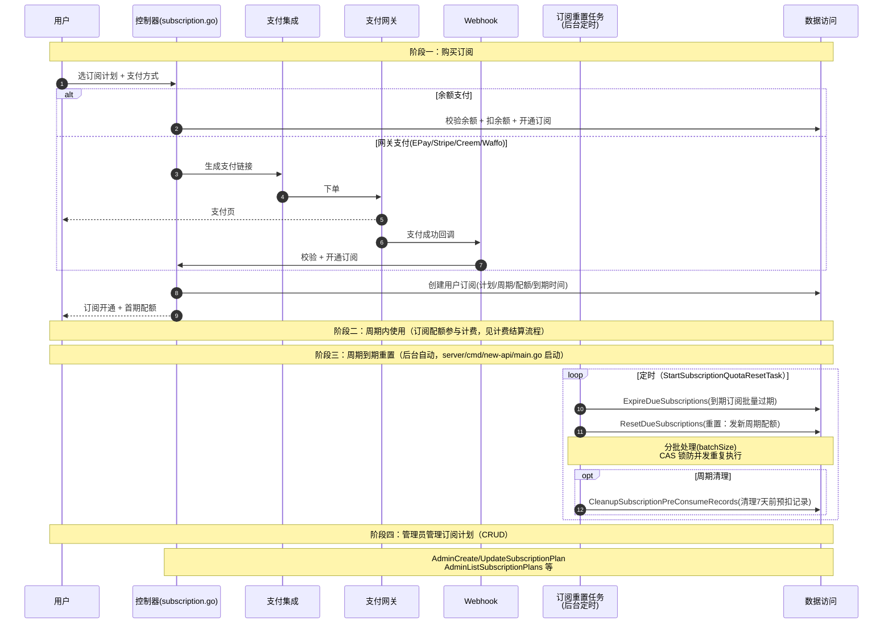

# 订阅流程（周期订阅）

> 用户购买周期订阅（日/周/月/自定义），获得周期性配额。与一次性充值的根本区别：订阅有**周期重置**——每个周期到期后由后台任务自动重置（过期 + 重发配额）。购买支持余额、EPay、Stripe、Creem、Waffo 多种支付。

## 时序图

## 流程说明

**阶段一：购买订阅**（`server/internal/controller/subscription.go`）
1. 用户选计划 + 支付方式。余额支付直接扣余额开通；网关支付（EPay/Stripe/Creem/Waffo）经支付集成下单 → webhook 回调开通（`SubscriptionEpayNotify`/`CreemWebhook` 等）。
2. 创建用户订阅记录（计划、周期、配额、到期时间），发放首期配额。

**阶段二：周期内使用** — 订阅配额参与计费结算流程（见 billing-settle.md）。

**阶段三：周期到期重置**（`server/internal/service/subscription_reset_task.go`，由 `server/cmd/new-api/main.go` 启动）
3. `StartSubscriptionQuotaResetTask` 定时（CAS 锁防并发）执行 `runSubscriptionQuotaResetOnce`：
   - `ExpireDueSubscriptions`：到期订阅批量置为过期（分批 batchSize）。
   - `ResetDueSubscriptions`：重置——按计划周期发新配额、推下个到期时间。
   - 定期（7 天周期）`CleanupSubscriptionPreConsumeRecords` 清理旧的预扣记录。

**阶段四：管理员管理订阅计划**（`Admin*SubscriptionPlan`）— 计划的 CRUD 与状态管理，纯管理操作。

## 涉及的 L3 逻辑模块

| 阶段 | 逻辑模块 | 模块文件 |
| --- | --- | --- |
| 购买控制器 | 控制器 | [api/controller.md](../modules/api/controller.md) |
| 网关支付 | HTTP 客户端与文件处理（支付集成） | [service/http-file-misc.md](../modules/service/http-file-misc.md) |
| 周期重置（后台） | 任务轮询与异步处理（含订阅重置任务） | [service/task-polling.md](../modules/service/task-polling.md) |
| 订阅/配额/日志 | 实体数据访问 | [data/data-access.md](../modules/data/data-access.md) |
| 配额入账 | 计费结算 | [service/billing.md](../modules/service/billing.md) |
