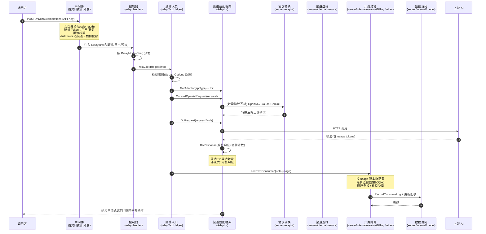

# 同步中继请求流程（chat / embedding / image / audio / rerank / responses）

> AI 调用方发起同步中继请求（如 `POST /v1/chat/completions`、`/v1/embeddings`、`/v1/images/generations` 等），new-api 内部从接收到响应返回的完整模块流转。这是系统最高频的核心路径。下图以 chat 为例，其他同步模式链路同构（见末尾说明）。

## 时序图

## 流程说明

1. **请求到达 + 鉴权分发**（中间件）：请求先经 `会话鉴权`（解析 API Key → 用户/令牌/分组）、`限流` 校验；`distributor` 中间件按分组/优先级**选择渠道**并**预扣配额**（防止超用），把渠道与预扣信息注入 `RelayInfo`。
2. **控制器分发**（控制器）：`server/internal/controller/relay.go` 的 `relayHandler` 按 `info.RelayMode`（Chat/Images/Audio/Embeddings/Rerank/Responses）分发到对应 Helper（chat 走 `relay.TextHelper`）。
3. **编排入口**（编排入口）：`relay.TextHelper`（`server/internal/relay/compatible_handler.go`）串联后续：模型映射、StreamOptions 处理、`GetAdaptor(apiType)` 选适配器、`adaptor.Init`。
4. **协议转换**（协议转换 + 渠道适配框架）：`adaptor.ConvertOpenAIRequest` 把 OpenAI 协议请求转成上游协议（如上游是 Claude/Gemini，经 relaykit 互转）。若是 passthrough 模式则跳过转换直接透传 body。
5. **上游调用**（渠道适配框架）：`adaptor.DoRequest` 发起对上游 AI 的 HTTP 调用。
6. **响应处理与令牌计数**（渠道适配框架）：`adaptor.DoResponse` 解析上游响应，**统计 usage tokens**（prompt/completion）。流式响应边收边向客户端转发，非流式等完整响应。
7. **计费结算**（计费结算）：`service.PostTextConsumeQuota` 按实际 usage 计算真实配额，与预扣比较——多扣的退还、少扣的补扣（经 `BillingSettler`）。分层计费走表达式引擎。
8. **持久化**（数据访问）：写 consume 日志、更新用户/令牌配额。完成。

> **计费关键点**：预扣在第 1 步（distributor）发生，结算在第 7 步发生——两者分离是为了防超用（先扣后用）又保证准确（按实际用量差额结算）。日志在第 8 步写。

## 涉及的 L3 逻辑模块

| 步骤 | 逻辑模块 | 模块文件 |
| --- | --- | --- |
| 1 鉴权/限流/分发 | 会话与令牌鉴权、中间件、渠道选择 | [auth/session-auth.md](../modules/auth/session-auth.md)、[api/middleware.md](../modules/api/middleware.md)、[service/channel-select.md](../modules/service/channel-select.md) |
| 2 控制器分发 | 控制器 | [api/controller.md](../modules/api/controller.md) |
| 3-6 编排/适配/转换/调用 | 编排入口、渠道适配框架、协议转换、中继上下文、中继辅助 | [relay/relay-orchestration.md](../modules/relay/relay-orchestration.md)、[relay/relay-adaptor.md](../modules/relay/relay-adaptor.md)、[relay/relaykit.md](../modules/relay/relaykit.md)、[relay/relay-context.md](../modules/relay/relay-context.md)、[relay/relay-helper.md](../modules/relay/relay-helper.md) |
| 6 令牌计数 | 令牌计数与用量 | [service/token-usage.md](../modules/service/token-usage.md) |
| 7 计费结算 | 计费结算、计费表达式引擎 | [service/billing.md](../modules/service/billing.md)、[pkg/billing-expr.md](../modules/pkg/billing-expr.md) |
| 8 持久化 | 实体数据访问 | [data/data-access.md](../modules/data/data-access.md) |
| 全程状态 | 中继上下文（RelayInfo 贯穿） | [relay/relay-context.md](../modules/relay/relay-context.md) |

## 其他同步模式（embedding / image / audio / rerank / responses）

以上流程以 chat（`relay.TextHelper`）为例。其他同步中继模式的链路**完全同构**，差异仅两处：

1. **控制器分发**：`server/internal/controller/relay.go:relayHandler` 按 `info.RelayMode` 分发到对应 Helper——
   - `RelayModeEmbeddings` → `relay.EmbeddingHelper`
   - `RelayModeImagesGenerations`/`ImagesEdits` → `relay.ImageHelper`
   - `RelayModeAudioSpeech`/`Translation`/`Transcription` → `relay.AudioHelper`
   - `RelayModeRerank` → `relay.RerankHelper`
   - `RelayModeResponses` → `relay.ResponsesHelper`
2. **适配器的 Convert 方法**：各模式调用适配器上对应的 Convert 方法（如 image 调 `ConvertImageRequest`，embedding 调 `ConvertEmbeddingRequest`，而非 chat 的 `ConvertOpenAIRequest`）。

除这两点外，"选渠道→预扣→上游调用→DoResponse 计数→结算→写日志"的后半链路各模式一致，都经过同一套计费结算与数据访问模块。

