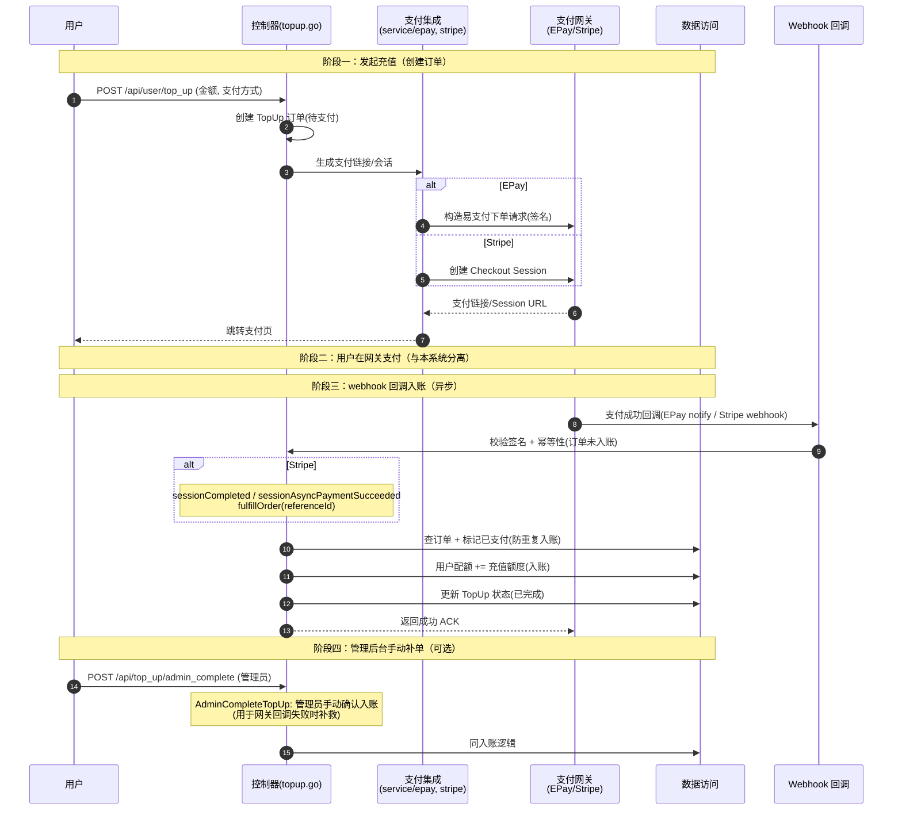

# 充值与支付流程（EPay / Stripe）

> 用户通过支付网关（易支付 EPay / Stripe）充值配额。核心特征是**异步**：发起充值后由支付网关经 **webhook 回调**通知支付结果，回调成功后才真正给用户入账配额。

## 时序图

## 流程说明

1. **发起充值**（`controller/topup.go`）：用户选金额与支付方式，控制器创建 TopUp 订单（待支付状态），调用支付集成（`service/epay.go` EPay / `service/topup_stripe.go` Stripe）生成支付链接/Session，跳转网关。
2. **网关支付**：用户在支付网关完成支付，与 new-api 分离。
3. **webhook 回调入账**（关键，异步）：网关支付成功后回调。
   - **EPay**：notify 回调，校验签名。
   - **Stripe**：`sessionCompleted`/`sessionAsyncPaymentSucceeded`（`topup_stripe.go:192/212`）→ `fulfillOrder`（259 行）按 referenceId 入账。
   - 校验幂等（订单未入账才处理），标记已支付，用户配额入账，更新订单状态。
4. **手动补单**（`AdminCompleteTopUp`，topup.go:495）：管理员在网关回调失败时手动确认入账的补救通道。

## 涉及的 L3 逻辑模块

| 阶段 | 逻辑模块 | 模块文件 |
| --- | --- | --- |
| 充值控制器 | 控制器 | [api/controller.md](../modules/api/controller.md) |
| 支付集成 | HTTP 客户端与文件处理（含 epay/stripe） | [service/http-file-misc.md](../modules/service/http-file-misc.md) |
| 订单/配额/入账 | 实体数据访问 | [data/data-access.md](../modules/data/data-access.md) |
| webhook | 任务轮询与异步处理（含 webhook） | [service/task-polling.md](../modules/service/task-polling.md) |
