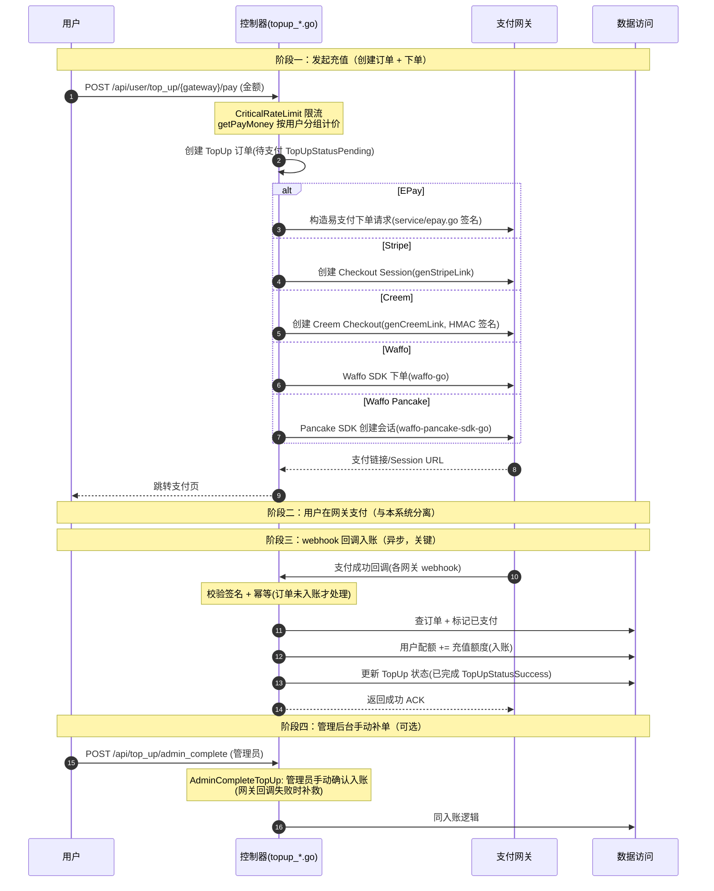

# 充值与支付流程

> 用户通过支付网关充值配额。支持五个网关：**EPay（易支付）/ Stripe / Creem / Waffo / Waffo Pancake**，五者结构同构（创建订单→跳转网关→webhook 回调入账），仅下单协议与签名/回调机制不同，按"同类实现"归为一个流程。核心特征是**异步**：发起充值后由支付网关经 **webhook 回调**通知结果，回调成功后才真正给用户入账配额。

## 时序图

## 流程说明

1. **发起充值**（`controller/topup_*.go`，路由 `POST /api/user/top_up/{gateway}/pay`，经 `CriticalRateLimit` 限流）：用户选金额，`getPayMoney` 按用户分组计价后创建 TopUp 订单（`TopUpStatusPending`），按所选网关调用对应下单逻辑生成支付链接并跳转。
   - **EPay**：`RequestEpay`（topup.go）→ `service/epay.go` 构造易支付下单请求（签名）。
   - **Stripe**：`RequestStripePay`/`RequestStripeAmount`（topup_stripe.go）→ `genStripeLink` 创建 Checkout Session。
   - **Creem**：`RequestCreemPay`（topup_creem.go）→ `genCreemLink` 创建 Checkout（HMAC-SHA256 签名）。
   - **Waffo**：`RequestWaffoPay`/`RequestWaffoAmount`（topup_waffo.go）→ `waffo-go` SDK 下单。
   - **Waffo Pancake**：`RequestWaffoPancakePay`/`RequestWaffoPancakeAmount`（topup_waffo_pancake.go）→ `waffo-pancake-sdk-go` 创建会话（`service/waffo_pancake.go` 封装）。
   - `RequestAmount`（topup.go）为通用金额/最低充值校验入口，供前端预校验。

2. **网关支付**：用户在支付网关完成支付，与 new-api 分离。

3. **webhook 回调入账**（关键，异步）：各网关支付成功后回调各自 webhook 端点，校验签名 + 幂等（订单未入账才处理），标记已支付，用户配额入账，更新订单状态为 `TopUpStatusSuccess`。
   - **EPay**：`EpayNotify`（topup.go），GET/POST 双入口，校验易支付签名。
   - **Stripe**：`StripeWebhook`（topup_stripe.go）→ `sessionCompleted`/`sessionAsyncPaymentSucceeded` → `fulfillOrder` 按 referenceId 入账。
   - **Creem**：`CreemWebhook`（topup_creem.go）→ `handleCheckoutCompleted` 校验 `creem-signature` 后入账。
   - **Waffo**：`WaffoWebhook`（topup_waffo.go）→ `handleWaffoPayment` 经 `core.PaymentNotificationResult` 入账。
   - **Waffo Pancake**：`WaffoPancakeWebhook`（topup_waffo_pancake.go）按 OrderMerchantExternalID（=trade_no）回查订单入账。

4. **手动补单**（`AdminCompleteTopUp`，topup.go）：管理员在网关回调失败时手动确认入账的补救通道，复用同一入账逻辑。

> 订阅付款（`controller/subscription_payment_*.go`，路由 `POST /api/subscription/{gateway}/pay` + `/api/subscription/epay/notify`）走同一组支付网关，区别在于入账目标是订阅计划而非用户配额；其支付网关交互与本流程同构，订阅侧的入账/状态推进见 [subscription.md](subscription.md)。

## 涉及的 L3 逻辑模块

| 阶段 | 逻辑模块 | 模块文件 |
| --- | --- | --- |
| 充值控制器（五网关 pay/amount/webhook） | 控制器 | [api/controller.md](../modules/api/controller.md) |
| EPay/Waffo Pancake 支付集成（service 层） | HTTP 客户端与文件处理（含 epay/waffo_pancake） | [service/http-file-misc.md](../modules/service/http-file-misc.md) |
| 订单/配额/入账 | 实体数据访问 | [data/data-access.md](../modules/data/data-access.md) |
