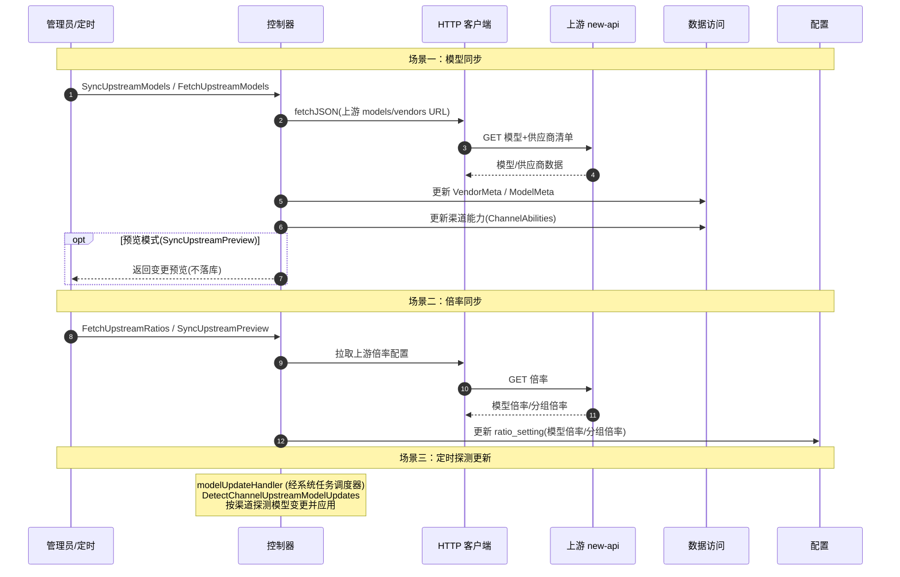

# 上游模型 / 倍率同步流程

> 从上游 new-api 实例（或渠道本身）拉取模型列表与计费倍率，更新本地渠道能力与配置。分两类：**模型同步**（更新渠道可用模型）与**倍率同步**（更新模型/分组计费倍率）。可手动触发或定时（经系统任务调度器）。

## 时序图

## 流程说明

1. **模型同步**（`server/internal/controller/model_sync.go:SyncUpstreamModels`）：从上游 new-api 的 models/vendors URL 拉取（`fetchJSON`），更新本地的 VendorMeta（供应商）、ModelMeta（模型元数据）与渠道能力（ChannelAbilities，决定某渠道支持哪些模型）。`SyncUpstreamPreview` 只返回变更预览不落库。
2. **倍率同步**（`server/internal/controller/ratio_sync.go:FetchUpstreamRatios`）：拉取上游的模型倍率/分组倍率，更新 `ratio_setting`（计费倍率配置）。
3. **定时探测**：经系统任务调度器的 `modelUpdateHandler`（见 background-tasks.md），按渠道定时 `DetectChannelUpstreamModelUpdates` 探测模型变更并应用。

## 涉及的 L3 逻辑模块

| 阶段 | 逻辑模块 | 模块文件 |
| --- | --- | --- |
| 同步控制器 | 控制器 | [api/controller.md](../modules/api/controller.md) |
| 拉取上游 | HTTP 客户端与文件处理 | [service/http-file-misc.md](../modules/service/http-file-misc.md) |
| 倍率更新 | 运行时配置 | [config/runtime-config.md](../modules/config/runtime-config.md) |
| 模型/供应商/渠道能力 | 实体数据访问 | [data/data-access.md](../modules/data/data-access.md) |
