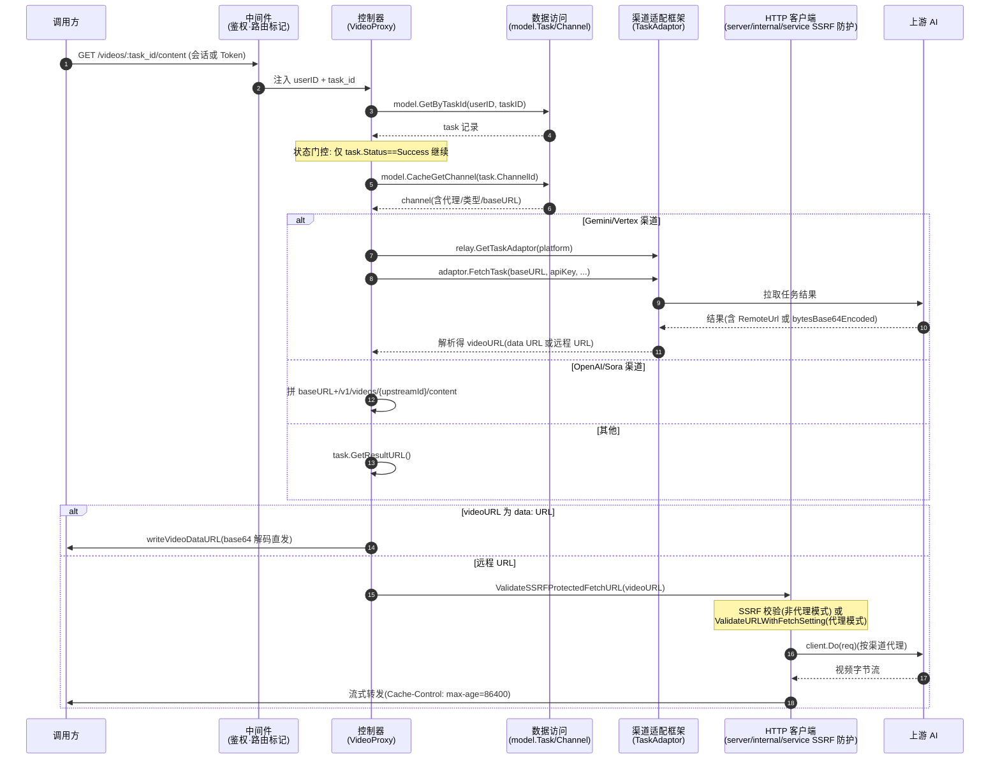

# 异步任务产物视频代理流程

> 调用方请求 `GET /videos/:task_id/content` 获取已完成异步任务的产物（视频/音频），new-api 按任务状态门控、按渠道类型解析上游产物 URL，经 SSRF 防护代理回拉并重发给调用方。跨任务结果状态、渠道适配器、HTTP 客户端三模块。

## 时序图

## 流程说明

1. **请求到达 + 鉴权**（中间件）：`GET /videos/:task_id/content` 经 `TokenOrUserAuth`（会话或 Token 均可）与 `RouteTag("server/internal/relay")` 路由标记后进入 `controller.VideoProxy`（`server/internal/controller/video_proxy.go:33`）。
2. **任务结果取回 + 状态门控**（数据访问）：`model.GetByTaskId(userID, taskID)` 取任务记录（`server/internal/controller/video_proxy.go:41`）；**状态门控**——仅 `task.Status == TaskStatusSuccess` 继续（line 52），非成功直接返回。随后 `model.CacheGetChannel(task.ChannelId)` 取渠道（line 58）。
3. **HTTP 客户端构建**（HTTP 客户端）：默认 `service.GetSSRFProtectedHTTPClient()`（line 71）；若渠道配置了代理则 `service.GetHttpClientWithProxy(proxy)`（line 75）。
4. **按渠道类型解析产物 URL**（渠道适配框架 / 控制器）：
   - **Gemini**：`getGeminiVideoURL` 经 `relay.GetTaskAdaptor` 调 `adaptor.FetchTask` + `ParseTaskResult` 取 `RemoteUrl`，附 `x-goog-api-key`（`server/internal/controller/video_proxy_gemini.go:15`）。
   - **Vertex AI**：`getVertexVideoURL` 同走 TaskAdaptor，且当负载含 `bytesBase64Encoded` 时合成 data URL（`server/internal/controller/video_proxy_gemini.go:148`）。
   - **OpenAI/Sora**：拼 `baseURL/v1/videos/{upstreamId}/content`，附 `Authorization: Bearer`（`server/internal/controller/video_proxy.go:115`）。
   - **其他**：`task.GetResultURL()`（line 119）。
5. **data URL 直发分支**：若 videoURL 以 `data:` 开头，`writeVideoDataURL` base64 解码后直发原始字节（`server/internal/controller/video_proxy.go:129,185`），不经上游。
6. **远程 URL 代理分支**（HTTP 客户端 + SSRF 防护）：`service.ValidateSSRFProtectedFetchURL`（非代理，line 139）或 `common.ValidateURLWithFetchSetting`（代理，line 142）校验后，`client.Do(req)` 回拉（line 157），复制响应头、设 `Cache-Control: public, max-age=86400`（line 178），`io.Copy` 流式转发（line 180）。

## 涉及的 L3 逻辑模块

| 阶段 | 逻辑模块 | 模块文件 |
| --- | --- | --- |
| 鉴权与路由标记 | 中间件 | [../modules/api/middleware.md](../modules/api/middleware.md) |
| 请求处理 + URL 解析 + 状态门控 | 控制器 | [../modules/api/controller.md](../modules/api/controller.md) |
| 任务/渠道取回 | 实体数据访问 | [../modules/data/data-access.md](../modules/data/data-access.md) |
| Gemini/Vertex 产物解析 | 渠道适配框架 | [../modules/relay/relay-adaptor.md](../modules/relay/relay-adaptor.md) |
| SSRF 防护 HTTP 客户端 | HTTP 客户端与文件处理 | [../modules/service/http-file-misc.md](../modules/service/http-file-misc.md) |
| 编排入口（GetTaskAdaptor 分发） | 编排入口 | [../modules/relay/relay-orchestration.md](../modules/relay/relay-orchestration.md) |
