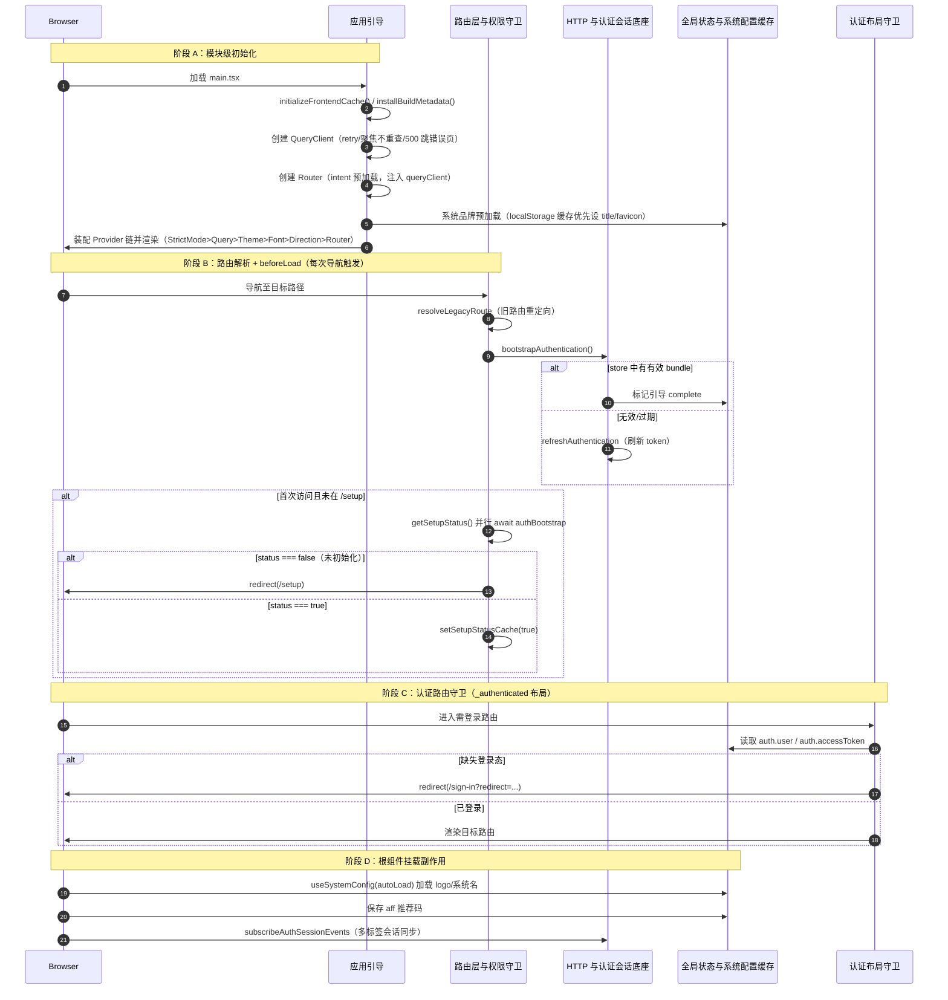

# 应用启动初始化

> 用户首次打开页面（或刷新）时，前端从 `main.tsx` 挂载到首屏就绪的启动时序：装配 Provider 链、创建 QueryClient/Router、预加载系统品牌、路由 `beforeLoad` 检查 setup 状态并引导认证会话、认证路由守卫门禁。

## 时序图

## 流程说明

1. **模块级初始化**（`main.tsx` 顶层）：`initializeFrontendCache()` 清理过期缓存、`installBuildMetadata()` 注入构建版本到 DOM/window/CSS 变量，导入 i18n 配置与全局样式。
2. **QueryClient 创建**（`main.tsx:53`）：配置 retry 策略（DEV 不重试、PROD 最多 3 次、401/403 不重试）、`refetchOnWindowFocus:false`、`staleTime:10s`；mutations.onError 经 `handleServerError` 转 toast；queryCache.onError 在 500 时 toast 并 `navigate('/500')`。
3. **Router 创建**（`main.tsx:97`）：`createRouter({ routeTree, context:{queryClient}, defaultPreload:'intent' })`，QueryClient 通过 context 注入使所有 loader/beforeLoad 共用同一实例。
4. **系统品牌预加载**（`main.tsx:117` IIFE）：localStorage `status` 缓存优先设 title/favicon，再 `getStatus()` 后台刷新回写，避免首屏品牌闪烁。
5. **Provider 装配与首屏渲染**（`main.tsx:158-173`）：按 `StrictMode → QueryClientProvider → ThemeProvider → FontProvider → DirectionProvider → RouterProvider` 顺序装配。
6. **路由 beforeLoad**（`__root.tsx:146`）：每次导航触发——先 `resolveLegacyRoute` 旧路由重定向；调 `bootstrapAuthentication()`（`auth-session.ts:363`）引导认证（有 bundle 直接 complete，否则刷新）；首次访问且未在 `/setup` 时并行 `getSetupStatus()`，若 `status===false` 抛 `redirect({to:'/setup'})`，否则 `setSetupStatusCache(true)`。
7. **认证布局守卫**（`_authenticated/route.tsx:25`）：`beforeLoad` 读 `useAuthStore.getState().auth`，无 user/accessToken 则 `redirect({to:'/sign-in', search:{redirect: location.href}})`。注意：引导（刷新 token）在 `__root.beforeLoad`，门禁（无 user 跳登录）在 `_authenticated.beforeLoad`，分层职责。
8. **根组件挂载副作用**（`RootComponent`）：`useSystemConfig({autoLoad:true})` 加载 logo/系统名；保存 `aff` 推荐码；`useAuthStore.subscribe` 监听 sid 变化清 queryClient 防数据串；`subscribeAuthSessionEvents` 多标签会话同步（authenticated 事件 reload，登出事件跳 sign-in）。

## 涉及的 L3 逻辑模块

| 阶段 | 逻辑模块 | 模块文件 |
| --- | --- | --- |
| 模块初始化/Provider 装配 | 应用引导 | [../modules/framework/app-bootstrap.md](../modules/framework/app-bootstrap.md) |
| 路由 beforeLoad/setup 检查 | 路由层与权限守卫 | [../modules/framework/routing-guard.md](../modules/framework/routing-guard.md) |
| 认证会话引导/多标签同步 | HTTP 与认证会话底座 | [../modules/infra/http-auth-base.md](../modules/infra/http-auth-base.md) |
| 认证态/系统配置持有 | 全局状态与系统配置缓存 | [../modules/infra/global-state.md](../modules/infra/global-state.md) |
| 登录守卫 | 路由层与权限守卫 | [../modules/framework/routing-guard.md](../modules/framework/routing-guard.md) |
