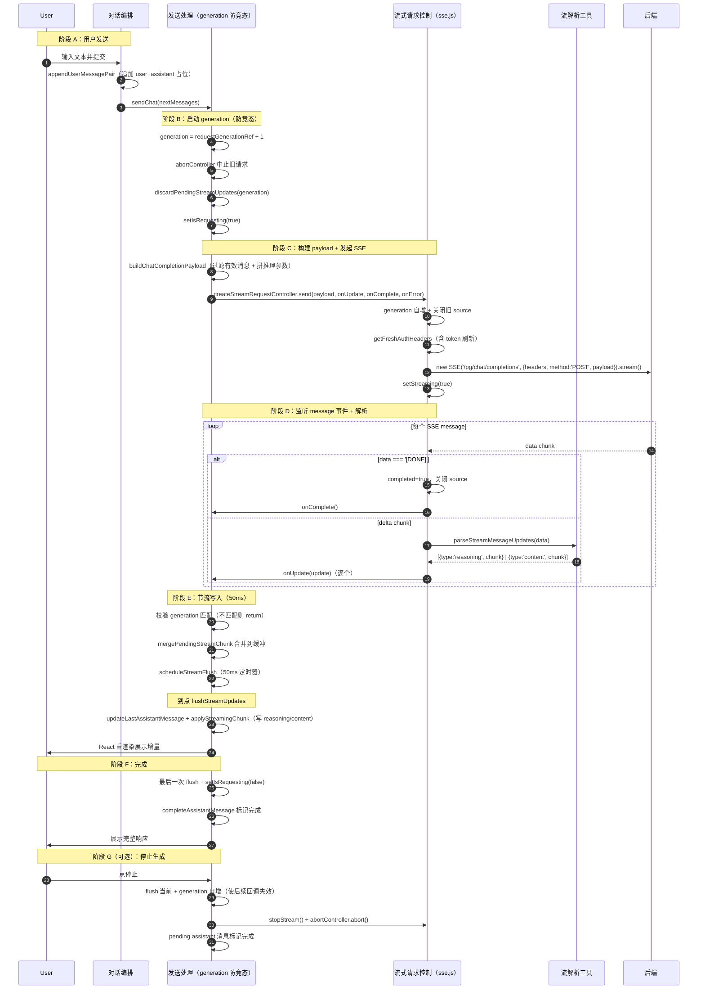

# Playground 流式对话

> 用户在对话调试场发送消息，前端通过 SSE（Server-Sent Events）发起流式 chat completions 请求，实时增量渲染 LLM 响应（含 reasoning 思考链），经双层 generation 防竞态与 50ms 节流批量 flush，直到 `[DONE]` 结束或用户停止。跨对话编排、发送处理、流式请求控制三个模块协作。

## 时序图

## 流程说明

1. **用户发送**（`usePlaygroundConversation.handleSendMessage`，`use-playground-conversation.ts:46`）：`appendUserMessagePair` 追加 user+assistant 占位 → `updateMessages` → `sendChat(nextMessages)`。
2. **分支**（`sendChat`，`use-chat-handler.ts:349`）：按 `config.stream` 选 `sendStreamingChat` 或 `sendNonStreamingChat`（非流式走 `sendChatCompletion`，`POST /pg/chat/completions`）。
3. **启动 generation**（`sendStreamingChat` 行 244）：`generation = requestGenerationRef.current + 1`，`abortControllerRef` 中止旧请求，`discardPendingStreamUpdates(generation)` 清空待写缓冲，`setIsRequesting(true)`。
4. **构建 payload**（`buildChatCompletionPayload`，`payload-builder.ts:30`）：过滤有效消息、`formatMessageForAPI`、按 `parameterEnabled` 拼接 temperature/top_p/max_tokens 等。
5. **发起 SSE**（`createStreamRequestController.send`，`use-stream-request.ts:73`）：`generation` 自增，关闭旧 source，`getFreshAuthHeaders`（`auth-session.ts:391`，含 token 刷新，与全局 axios 解耦）→ `new SSE('/pg/chat/completions', { headers, method:'POST', payload })` → `source.stream()`，`setStreaming(true)`。
6. **监听 message 事件**（行 113）：`isStreamDoneMessage(data)`（`data === '[DONE]'`）→ 完成；否则 `parseStreamMessageUpdates(data)`（`stream-utils.ts:67`）取 `choices[0].delta`，产出 `{type:'reasoning', chunk: delta.reasoning_content}` 与 `{type:'content', chunk: delta.content}`，逐个 `onUpdate`。
7. **节流写入**（`handleStreamUpdate` 行 190）：先校验 `generation` 匹配，`mergePendingStreamChunk` 合并到 `pendingStreamChunksRef`，`scheduleStreamFlush` 启 50ms（`STREAM_UPDATE_FLUSH_MS`）定时器；到点 `flushStreamUpdates`（行 98）→ `updateLastAssistantMessage` + `applyStreamingChunk`。`generation !== requestGenerationRef.current` 时直接 return（防竞态）。
8. **完成**（`handleStreamComplete` 行 204）：最后一次 flush，`setIsRequesting(false)`，`completeAssistantMessage`。
9. **异常**（`handleStreamError` 行 222）：`error`/`readystatechange` 事件 → `parseStreamErrorDetails`/`getStreamReadyStateError` → flush + `toast.error` + `updateAssistantMessageWithError`。
10. **停止**（`stopGeneration` 行 361）：flush 当前，`generation` 自增使后续回调失效，`stopStream()` + `abortController.abort()`，pending assistant 消息标记完成。

## 涉及的 L3 逻辑模块

| 阶段 | 逻辑模块 | 模块文件 |
| --- | --- | --- |
| 消息编排/重生成/编辑 | AI 对话调试场 | [../modules/admin-channels/playground.md](../modules/admin-channels/playground.md) |
| 响应渲染/对话 UI | AI 对话呈现组件 | [../modules/ui/ai-elements.md](../modules/ui/ai-elements.md) |
| 认证 header/刷新 | HTTP 与认证会话底座 | [../modules/infra/http-auth-base.md](../modules/infra/http-auth-base.md) |

## 项目约束（若有）

- **双层 generation 防竞态**：`useStreamRequest` 控制器内部 `generation`（管 sse.js source 生命周期）+ `useChatHandler` 的 `requestGenerationRef`（管 React 状态写入），两层都校验回调归属，避免新旧请求交错渲染。
- **认证解耦**：流式请求通过 `getFreshAuthHeaders` 独立获取带刷新的 token，不走全局 axios `api` 实例（sse.js 走独立连接），需自行处理 401 刷新。
- **50ms 节流**：`STREAM_UPDATE_FLUSH_MS = 50`，用 `setTimeout` 合并多次 delta，避免每个 token 触发一次 React 渲染。
- **合并策略**：`mergePendingStreamChunk`（行 55）处理后端增量 vs 全量两种 chunk 风格（新 chunk 若以旧 chunk 为前缀则替换，否则拼接）。
