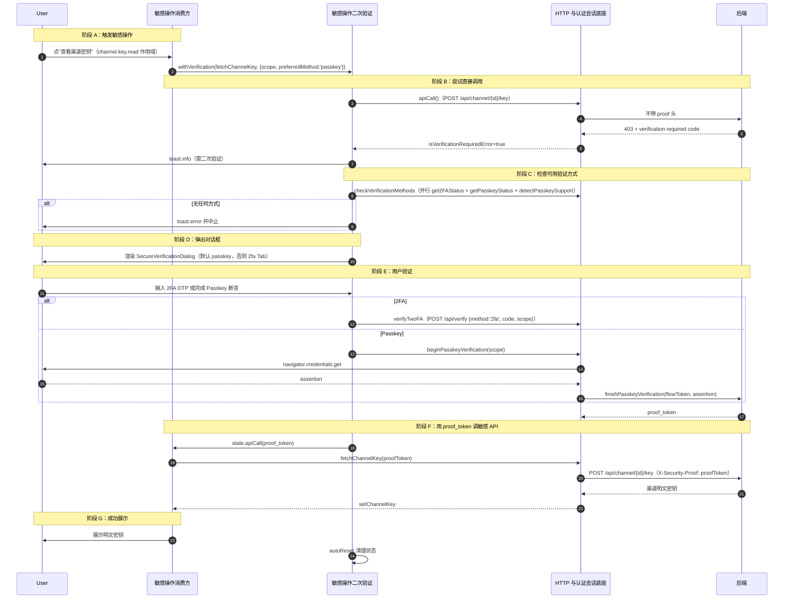

# 敏感操作二次验证

> 用户执行敏感操作（如查看渠道密钥）时，后端返回 403 要求二次验证，前端弹出安全验证对话框，用户以 2FA OTP 或 Passkey 完成 Security Proof，获取 `proof_token` 后携带 `X-Security-Proof` 头重试敏感 API。跨敏感操作消费方、二次验证模块、HTTP 底座协作。

## 时序图

## 流程说明

1. **触发敏感操作**（`channel-mutate-drawer.tsx:3032`）：用户点"查看密钥"，`handleRevealKey`（行 1378）调 `withVerification(fetchChannelKey, { scope: 'channel.key.read', preferredMethod: 'passkey', title, description })`。
2. **尝试直接调用**（`withVerification`，`use-secure-verification.ts:199`）：先尝试 `apiCall()`；若抛出 `isVerificationRequiredError`（403 + 特定 code，`lib/secure-verification.ts:30`），`toast.info` 后进入 `startVerification`。这是**被动验证模式**——先试调，遇 403 再验证。另有主动验证模式（直接 `startVerification`）。
3. **检查可用验证方式**（`startVerification` 行 82）：`fetchVerificationMethods` → `checkVerificationMethods`（`api.ts:44`）并行 `get2FAStatus` + `getPasskeyStatus` + `detectPasskeySupport`。若无任何方式则 `toast.error` 并 return false。
4. **弹出对话框**：选默认 method（passkey 优先，否则 2fa），`setOpen(true)`，`SecureVerificationDialog` 渲染对应 Tab。
5. **用户验证**（`handleVerify`，`dialog.tsx:78`）：点 Verify → `onVerify(method, code)` → `executeVerification`（`use-secure-verification.ts:135`）→ `verify(method, scope, code)`（`api.ts:78`）。2FA 走 `POST /api/verify`；Passkey 走 `beginPasskeyVerification`(scope) → `navigator.credentials.get` → `finishPasskeyVerification`。两者均返回 `proof_token`。
6. **用 proof_token 调敏感 API**（行 159）：`state.apiCall(proof.proof_token)` → `fetchChannelKey(proofToken)`（行 1354）→ `getChannelKey(channelId, proofToken)`（`channels/api.ts:296`，`POST /api/channel/{id}/key`，带 `X-Security-Proof: proofToken` 头）→ 成功 `setChannelKey`。
7. **成功/失败**：`onSuccess` 触发，`autoReset` 清理；失败 `toast.error`。

## 涉及的 L3 逻辑模块

| 阶段 | 逻辑模块 | 模块文件 |
| --- | --- | --- |
| 触发敏感操作 | 渠道管理 | [../modules/admin-channels/channels.md](../modules/admin-channels/channels.md) |
| 二次验证编排/对话框/proof 获取 | 敏感操作二次验证 | [../modules/auth/secure-verification.md](../modules/auth/secure-verification.md) |
| HTTP 请求/错误识别 | HTTP 与认证会话底座 | [../modules/infra/http-auth-base.md](../modules/infra/http-auth-base.md) |
| Passkey 编解码 | OAuth 与 Passkey 免密登录 | [../modules/auth/oauth-passkey.md](../modules/auth/oauth-passkey.md) |

## 项目约束（若有）

- **proof_token 透传契约**：`verify` 返回的 `proof_token` 必须经消费方放入 `X-Security-Proof` 请求头传给后端敏感 API，不得放入 URL 或 body。
- **真实消费方说明**：当前 secure-verification 的真实消费方是渠道密钥查看（`channel-mutate-drawer` 的 `getChannelKey`）与 Passkey 注册/删除（`passkey-card`）。API Key 明文查询（`fetchTokenKey`）走独立的批量缓存机制（`useRevealTokenKey`），不经过本二次验证流程。
- 支持**主动验证**（直接 `startVerification`）与**被动验证**（`withVerification` 先试调遇 403 再验证）两种触发模式。
