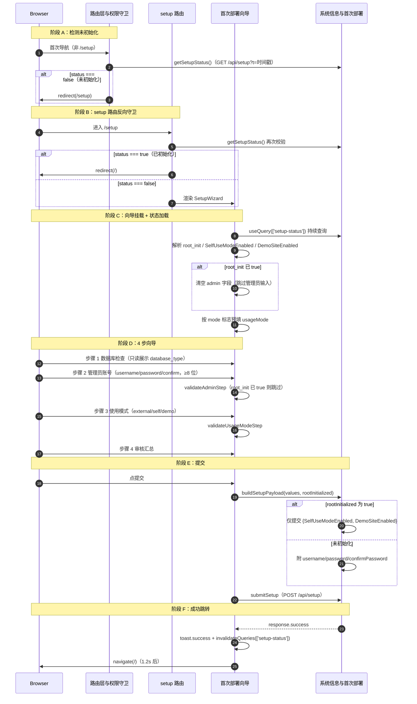

# 首次部署初始化向导

> 系统后端就绪但未初始化时，前端检测到 `setup status === false` 强制重定向到 4 步向导（数据库检查 → 管理员账号 → 使用模式 → 审核提交），完成首次部署。由 `__root.tsx` 启动期检查触发，无独立 HTTP 守卫。

## 时序图

## 流程说明

1. **检测未初始化**（`__root.tsx:158`）：`needsSetupCheck = !setupStatusChecked && !pathname.startsWith('/setup')`，调 `getSetupStatus`（`GET /api/setup?t=Date.now()` 强制新鲜，不进浏览器缓存），若 `status.data.status === false` 抛 `redirect({to:'/setup'})`，否则 `setSetupStatusCache(true)` 避免重复检查。
2. **setup 路由反向守卫**（`routes/setup/index.tsx:25`）：进入 `/setup` 前再次 `getSetupStatus`，若已 `status === true` 抛 `redirect({to:'/'})`，防止已初始化系统访问向导。三处 setup 状态检查协作：`__root.beforeLoad`（首次放行/重定向）→ `setup/index.beforeLoad`（反向拦截）→ `SetupWizard.useQuery`（渲染期持续查询）。
3. **向导挂载与状态加载**（`setup-wizard.tsx:76`）：`useQuery(['setup-status'])` 拉取；`useEffect`（行 124）处理：若 `status===true` 跳 `/`；否则 `setSetupStatus`、`setCurrentStep(0)`，按 `SelfUseModeEnabled`/`DemoSiteEnabled` 预填 usageMode，若 `root_init` 已为 true 则清空 admin 字段。
4. **4 步向导**（`STEPS` 数组，行 50）：① 数据库检查（`DatabaseStep`，只读）；② 管理员账号（`AdminStep`，`validateAdminStep` 校验用户名非空、密码 ≥8、两次一致；`root_init` 已 true 则跳过校验）；③ 使用模式（`UsageModeStep`，external/self/demo，`validateUsageModeStep`）；④ 审核（`CompleteStep`，汇总展示）。
5. **提交**（`handleSubmit` 行 268）：`buildSetupPayload(values, rootInitialized)`（`api.ts:40`）按 `root_init` 决定 payload 形态——已初始化只提交模式标志，未初始化附管理员凭证；`mutation.mutate(payload)` → `submitSetup`（`POST /api/setup`）。
6. **成功跳转**（`onSuccess` 行 106）：`response.success` → `toast.success` + `invalidateQueries(['setup-status'])` + `setTimeout(()=>navigate('/'), 1200)`。`invalidateQueries` 触发 `__root.beforeLoad` 重新检查，此时新 status 已为 true 放行。

## 涉及的 L3 逻辑模块

| 阶段 | 逻辑模块 | 模块文件 |
| --- | --- | --- |
| setup 状态检查/重定向 | 路由层与权限守卫 | [../modules/framework/routing-guard.md](../modules/framework/routing-guard.md) |
| 向导 UI/表单/提交 | 系统信息与首次部署 | [../modules/admin-channels/system-info-runtime.md](../modules/admin-channels/system-info-runtime.md) |
| 状态查询与缓存 | 应用引导（QueryClient） | [../modules/framework/app-bootstrap.md](../modules/framework/app-bootstrap.md) |
