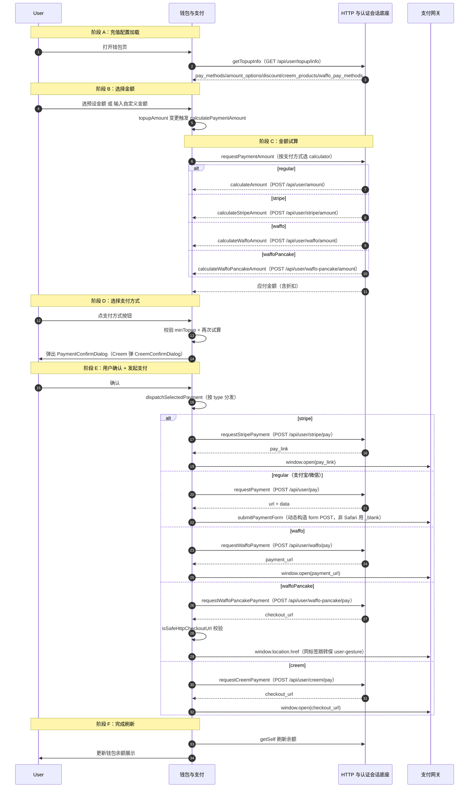

# 在线充值支付

> 用户在钱包页选择充值金额与支付方式，经金额试算、用户确认、按支付网关分发发起支付，跳转到外部支付网关或弹出网关确认窗口完成充值。跨充值配置加载、金额试算、多支付网关分发三个模块协作。

## 时序图

## 流程说明

1. **充值配置加载**（`useTopupInfo`，`use-topup-info.ts:166`）：挂载即调 `getTopupInfo`（`GET /api/user/topup/info`），解析出 `pay_methods`、`amount_options`、`discount`、`creem_products`、`waffo_pay_methods`。
2. **选择金额**（`index.tsx:159/166`）：用户选预设 `handleSelectPreset` 或自定义 `handleTopupAmountChange`，`topupAmount` 变更即触发 `calculatePaymentAmount`。
3. **金额试算**（`usePayment.calculatePaymentAmount`，`use-payment.ts:88`）：`requestPaymentAmount` 按 `isStripePayment`/`isWaffoPayment`/`isWaffoPancakePayment` 选择 calculator 调对应 amount API，返回应付金额（含折扣）。注意试算请求带 `skipBusinessError: true` 避免业务错误被全局拦截。
4. **选择支付方式**（`index.tsx:173`）：`handlePaymentMethodSelect` 设 `selectedPaymentMethod`，校验 `minTopup`，再次 `calculatePaymentAmount`，置 `confirmDialogOpen=true` 弹 `PaymentConfirmDialog`。Waffo 走 `handleWaffoMethodSelect`，Creem 走 `handleCreemProductSelect` 弹 `CreemConfirmDialog`。
5. **用户确认 + 发起支付**（`handlePaymentConfirm` 行 194 → `dispatchSelectedPayment`，`payment.ts:102`）：按 `paymentMethod.type` 分发到三个 processor。
6. **跳转支付网关**（`processing=true`）：各支付方式拿到网关返回的 URL/表单数据后跳转——stripe `window.open(pay_link)`；regular `submitPaymentForm`（动态构造 form POST）；waffo `window.open(payment_url)`；waffoPancake 经 `isSafeHttpCheckoutUrl` 校验后 `window.location.href`（同标签跳转避免丢失 user-gesture）；creem `window.open(checkout_url)`。
7. **完成刷新**：成功后 `getSelf`（`fetchUser`）刷新余额。

## 涉及的 L3 逻辑模块

| 阶段 | 逻辑模块 | 模块文件 |
| --- | --- | --- |
| 配置加载/试算/支付分发 | 钱包与支付 | [../modules/billing/wallet-payment.md](../modules/billing/wallet-payment.md) |
| HTTP 请求/认证 | HTTP 与认证会话底座 | [../modules/infra/http-auth-base.md](../modules/infra/http-auth-base.md) |
| 货币换算 | 通用工具库 | [../modules/infra/utils.md](../modules/infra/utils.md) |

## 项目约束（若有）

- 试算与支付 API 调用带 `skipBusinessError: true`，避免业务错误（如最低充值限制）被全局 toast 拦截，交由表单内联处理。
- waffoPancake 的 `checkout_url` 经 `isSafeHttpCheckoutUrl` 安全校验后才跳转，防开放重定向。
