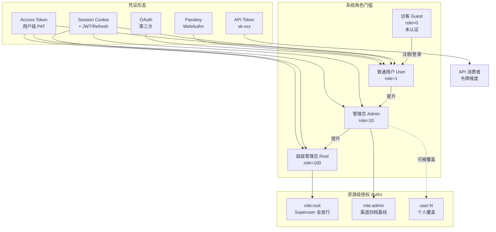
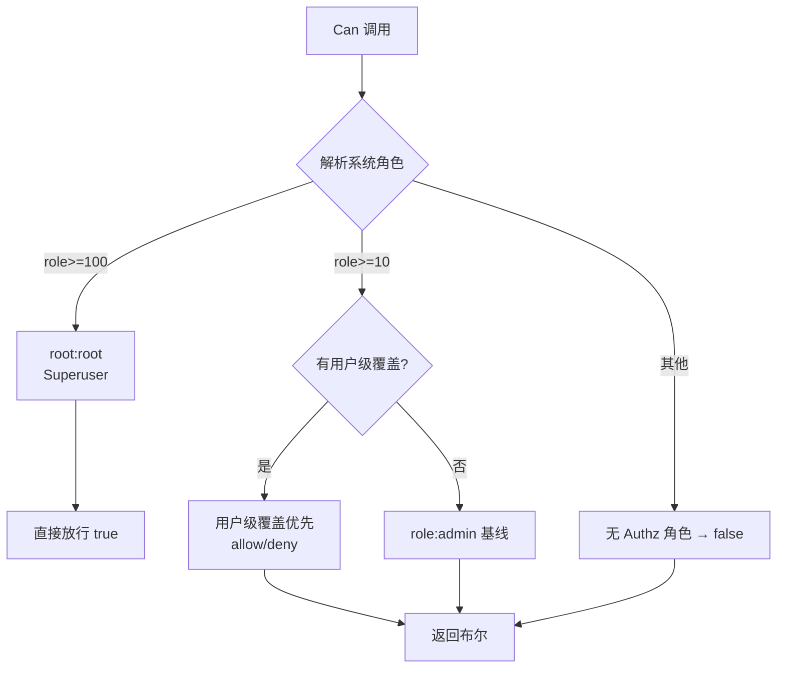

# 用户角色清单

> 版本：v1.0 ｜ 来源：代码逆向提炼 ｜ 维护：产品/架构组
>
> 本文档穷举 new-api 系统中所有用户角色，基于 `common/constants.go`、`middleware/auth.go`、`service/authz/`、`router/*.go` 与 `web/src/lib/roles.ts` 的实际代码提炼。

---

## 1. 角色体系总览

new-api 的访问控制由**两套机制叠加**构成：

1. **系统角色（System Role）**：用户表 `users.role` 字段，整型枚举，决定**全局功能边界**（能进入哪些路由组）。由 `authHelper(c, minRole)` 在中间件层做 `user.Role < minRole` 的门槛校验。
2. **资源级授权（Authz / RBAC）**：基于 Casbin 的细粒度权限，决定管理员在**特定资源**（目前为 `channel`）上能做哪些**动作**。支持角色基线（Role Baseline）+ 用户级覆盖（Per-User Override）。

### 角色一览表

| 角色中文名 | 角色标识 | role 值 | 前端枚举 | 凭证方式 | 核心定位 |
|---|---|---|---|---|---|
| 访客 | `RoleGuestUser` | 0 | `ROLE.GUEST` | 无 | 未认证的公开访问者 |
| 普通用户 | `RoleCommonUser` | 1 | `ROLE.USER` | Session / PAT / OAuth / Passkey | 终端开发者，使用 API 与个人面板 |
| 管理员 | `RoleAdminUser` | 10 | `ROLE.ADMIN` | Session / PAT | 运营/运维，管理用户/渠道/模型 |
| 超级管理员 | `RoleRootUser` | 100 | `ROLE.SUPER_ADMIN` | Session / PAT | 系统负责人，全局配置与敏感操作 |

> 代码位置：`common/constants.go:179-182`、`web/src/lib/roles.ts:21-27`

---

## 2. 角色一：访客（Guest）

| 属性 | 值 |
|---|---|
| 标识 | `RoleGuestUser = 0` |
| 认证 | 无需认证 |
| 来源 | 未登录的所有请求方 |

### 能力边界（仅限公开端点）

访客**不能**调用任何需要 `UserAuth`/`AdminAuth`/`RootAuth`/`TokenAuth` 的接口。可访问的公开端点：

| 端点 | 用途 | 鉴权链 |
|---|---|---|
| `GET /api/status` | 系统状态 | 无 |
| `GET /api/notice` | 公告 | 无 |
| `GET /api/about` | 关于页 | 无 |
| `GET /api/user-agreement` | 用户协议 | 无 |
| `GET /api/privacy-policy` | 隐私政策 | 无 |
| `GET /api/home_page_content` | 首页内容 | 无 |
| `GET /api/pricing` | 定价页 | `HeaderNavModuleAuth("pricing")`（可配置需登录） |
| `GET /api/rankings` | 排行榜 | `HeaderNavModuleAuth("rankings")`（可配置需登录） |
| `GET /api/perf-metrics`、`/summary` | 性能指标摘要 | `HeaderNavModulePublicOrUserAuth`（可配置） |
| `POST /api/setup` | 初始化（仅首启） | 无 |
| `POST /api/user/register` | 注册 | Turnstile + 限流 |
| `POST /api/user/login` 等 | 登录系列 | Turnstile + 限流 |
| `POST /api/user/reset` | 密码重置 | 限流 |
| `GET/POST /api/oauth/:provider` | OAuth 登录 | 限流（`TryUserAuth` 可选携带身份） |
| `POST /api/stripe/webhook` 等 | 支付回调 | 签名校验，非用户认证 |
| `GET /api/verification` | 邮箱验证码 | 限流 + Turnstile |

### 文件/媒体权限

`common/constants.go:190-193` 定义了文件上传下载的最低角色门槛，默认均为 `RoleGuestUser`：
- `FileUploadPermission`、`FileDownloadPermission`
- `ImageUploadPermission`、`ImageDownloadPermission`

> 含义：默认情况下访客即可上传/下载文件与图片（受接口本身的鉴权约束）。

---

## 3. 角色二：普通用户（User）

| 属性 | 值 |
|---|---|
| 标识 | `RoleCommonUser = 1` |
| 认证 | Session Cookie（JWT Access + Refresh）、Access Token（PAT）、OAuth 绑定、Passkey |
| 中间件 | `UserAuth()` → `authHelper(c, RoleCommonUser)` |
| 前端标识 | `ROLE.USER` |

普通用户是系统的**主要终端使用者**：既是 API 的消费者（通过其创建的 Token），也是管理面板的使用者（管理自己的资源）。

### 3.1 个人资源管理（`selfRoute`，`UserAuth`）

| 能力 | 端点 | 说明 |
|---|---|---|
| 查看个人信息 | `GET /api/user/self` | |
| 修改个人信息 | `PUT /api/user/self` | |
| 注销账号 | `DELETE /api/user/self` | |
| 查看可用分组 | `GET /api/user/self/groups`、`/user/groups` | |
| 查看可用模型 | `GET /api/user/models` | |
| 生成/管理 PAT | `GET /api/user/token` | 生成 Access Token |
| 修改用户设置 | `PUT /api/user/setting` | |

### 3.2 会话与安全

| 能力 | 端点 | 说明 |
|---|---|---|
| 登录会话管理 | `GET /api/user/sessions`、`DELETE /:sid`、`POST /sessions/revoke-others` | 查看并远程登出会话 |
| 刷新令牌 | `POST /api/user/auth/refresh` | |
| 登出 | `POST /api/user/auth/logout` | |
| Passkey 管理 | `GET /passkey`、`POST /passkey/register/*`、`/verify/*`、`DELETE /passkey` | 注册/验证/删除 |
| 2FA 管理 | `GET /2fa/status`、`POST /2fa/setup`、`/enable`、`/disable`、`/backup_codes` | TOTP 双因素 |
| OAuth 绑定 | `GET /oauth/bindings`、`DELETE /:provider_id` | 查看与解绑第三方 |
| 安全验证 | `POST /api/verify` | 通用安全验证（用于敏感操作前置） |

### 3.3 令牌（API Key）管理（`tokenRoute`，`UserAuth`）

| 能力 | 端点 | 说明 |
|---|---|---|
| 令牌 CRUD | `GET/POST/PUT/DELETE /api/token/*` | 创建/编辑/删除自己的 Token |
| 令牌搜索 | `GET /api/token/search` | 受 SearchRateLimit |
| 查看密钥 | `POST /api/token/:id/key`、`/batch/keys` | 受 CriticalRateLimit |
| 自动分组 | `GET /api/token/auto-groups` | 查询令牌的 auto_groups |

### 3.4 财务与充值

| 能力 | 端点 | 说明 |
|---|---|---|
| 充值 | `POST /api/user/topup`、`/pay`、`/stripe/pay`、`/creem/pay`、`/waffo/pay` 等 | 多支付网关 |
| 充值记录 | `GET /api/user/topup/self`、`/topup/info` | |
| 金额估算 | `POST /api/user/amount`、`/stripe/amount` 等 | |
| 兑换码兑换 | `POST /api/user/topup` | |
| 邀请返佣 | `GET /api/user/aff`、`POST /api/user/aff_transfer` | 邀请码与额度转移 |

### 3.5 订阅

| 能力 | 端点 | 说明 |
|---|---|---|
| 查看订阅计划 | `GET /api/subscription/plans` | |
| 查看自己的订阅 | `GET /api/subscription/self` | |
| 设置计费偏好 | `PUT /api/subscription/self/preference` | 钱包/订阅优先 |
| 购买订阅 | `POST /api/subscription/{balance,epay,stripe,creem,waffo-pancake}/pay` | |

### 3.6 签到与日志（自身）

| 能力 | 端点 | 说明 |
|---|---|---|
| 每日签到 | `GET/POST /api/user/checkin` | 赠送配额 |
| 自身日志 | `GET /api/log/self`、`/self/stat`、`/self/search` | 仅看自己 |
| 自身配额流水 | `GET /api/data/self`、`/flow/self` | |
| 自身任务/MJ | `GET /api/task/self`、`/mj/self` | |

### 3.7 Playground

| 能力 | 端点 | 说明 |
|---|---|---|
| 控制台试用 | `POST /pg/chat/completions` | `UserAuth + Distribute`，Session 鉴权 |

---

## 4. 角色三：管理员（Admin）

| 属性 | 值 |
|---|---|
| 标识 | `RoleAdminUser = 10` |
| 认证 | Session / PAT |
| 中间件 | `AdminAuth()` → `authHelper(c, RoleAdminUser)` |
| Authz 角色 | `role:admin`（非 Superuser） |
| 前端标识 | `ROLE.ADMIN` |

管理员继承普通用户的**全部能力**，并额外获得**运营管理**权限。写操作自动触发审计（`beginAdminAudit`/`finishAdminAudit`）。

### 4.1 用户管理（`adminRoute`，`AdminAuth`）

| 能力 | 端点 | 说明 |
|---|---|---|
| 用户列表/搜索 | `GET /api/user/`、`/search` | |
| 用户详情 | `GET /api/user/:id` | |
| 创建用户 | `POST /api/user/` | |
| 编辑用户 | `PUT /api/user/` | |
| 删除用户 | `DELETE /api/user/:id` | |
| 管理操作 | `POST /api/user/manage` | 启用/禁用/调整角色等（`myRole > targetRole` 才可操作） |
| 充值管理 | `GET /api/user/topup`、`POST /topup/complete` | 补单 |
| 清除绑定 | `DELETE /:id/bindings/:type` | 解绑用户第三方 |
| OAuth 绑定管理 | `GET /:id/oauth/bindings`、`DELETE /:id/oauth/bindings/:pid` | |
| 重置 Passkey | `DELETE /:id/reset_passkey` | |
| 2FA 管理 | `GET /2fa/stats`、`DELETE /:id/2fa` | 统计与强制禁用 |

> 角色提升约束：`controller/user.go:372` — `myRole == RoleRootUser || myRole > targetRole`，即管理员只能管理比自己角色低的用户。

### 4.2 渠道管理（`channelRoute`，`AdminAuth` + Authz）

渠道是**唯一**接入资源级 Authz 的资源，管理员在此被进一步细分（见第 7 节）。

| 能力 | 端点 | Authz 权限 |
|---|---|---|
| 查看渠道列表/详情 | `GET /api/channel/`、`/:id`、`/search`、`/models` | `ChannelRead` |
| 编辑渠道配置 | `PUT /api/channel/` | `ChannelWrite` |
| 编辑敏感字段 | `POST /api/channel/`（创建） | `ChannelSensitiveWrite` |
| 删除渠道 | `DELETE /:id`、`/batch`、`/disabled` | `ChannelSensitiveWrite` |
| 测试/启停/批量操作 | `GET /test`、`POST /:id/status`、`/status/batch`、`/tag/*` | `ChannelOperate` |
| 余额更新 | `GET /update_balance` | `ChannelOperate` |
| 能力表修复 | `POST /fix` | `ChannelOperate` |

### 4.3 其他管理域（`AdminAuth`）

| 域 | 端点 | 说明 |
|---|---|---|
| 兑换码 | `/api/redemption/*` | CRUD |
| 全局日志 | `GET /api/log/`、`/stat`、`/search` | 全用户日志 |
| 配额流水 | `GET /api/data/`、`/users`、`/flow` | 全局统计 |
| 分组 | `GET /api/group/` | 查看分组 |
| 预填充分组 | `/api/prefill_group/*` | CRUD |
| 模型元数据 | `/api/models/*` | CRUD、上游同步、缺失检测 |
| 厂商 | `/api/vendors/*` | CRUD |
| Midjourney/Task 全局 | `GET /api/mj/`、`/task/` | 全用户任务 |
| 订阅管理 | `/api/subscription/admin/*` | 计划 CRUD、用户订阅管理 |
| Authz 目录 | `GET /api/authz/catalog` | 权限目录（Admin 可查） |
| 系统状态测试 | `GET /api/status/test` | |
| Dashboard 模型列表 | `GET /api/models`（dashboard） | |

---

## 5. 角色四：超级管理员（Root）

| 属性 | 值 |
|---|---|
| 标识 | `RoleRootUser = 100` |
| 认证 | Session / PAT |
| 中间件 | `RootAuth()` → `authHelper(c, RoleRootUser)` |
| Authz 角色 | `role:root`（**Superuser**，全权限自动放行） |
| 前端标识 | `ROLE.SUPER_ADMIN` |

超级管理员继承管理员的**全部能力**，且在 Authz 中是 **Superuser**——`Can()` 函数对其短路返回 `true`，无需任何显式策略。独占以下系统级域：

### 5.1 系统配置（`optionRoute`，`RootAuth`）

| 能力 | 端点 | 说明 |
|---|---|---|
| 系统选项读写 | `GET/PUT /api/option/` | 全局热配置 |
| 支付合规确认 | `POST /api/option/payment_compliance` | |
| 重置模型倍率 | `POST /api/option/rest_model_ratio` | |
| 渠道亲和缓存 | `GET/DELETE /api/option/channel_affinity_cache` | |
| Waffo-Pancake 商品 | `/api/option/waffo-pancake/*` | 目录/配对/订阅产品 |

### 5.2 独占管理域

| 域 | 端点 | 说明 |
|---|---|---|
| 自定义 OAuth 提供商 | `/api/custom-oauth-provider/*` | 含 OIDC Discovery |
| 性能运维 | `/api/performance/*` | 统计、清缓存、强制 GC、日志文件 |
| 费率同步 | `/api/ratio_sync/*` | 上游定价拉取 |
| 系统任务 | `/api/system-task/*` | 日志清理等定时任务 |
| 系统实例 | `/api/system-info/*` | 多节点管理、陈旧节点清理 |
| 渠道密钥查看 | `POST /api/channel/:id/key` | 需 **RootAuth + CriticalRateLimit + SecureVerificationRequired** |

> 渠道密钥查看是**最高敏感操作**：需 Root 角色 + 关键操作限流 + 安全验证（二次验证）三重门槛（`router/channel-router.go:23-29`）。

---

## 6. 特殊角色：API 消费者（Token 维度）

> 这不是一个独立的系统角色，而是**普通用户通过 API Token 调用 Relay 时的运行时身份**。因其权限模型独立于系统角色，单列说明。

| 属性 | 值 |
|---|---|
| 标识 | 无 role 值；由 Token（`sk-xxx`）表征 |
| 认证 | `TokenAuth()` / `TokenAuthReadOnly()` / `TokenOrUserAuth()` |
| 中间件 | `middleware.TokenAuth()` → `model.ValidateUserToken(key)` |
| 关联用户 | `token.UserId`（必须属于一个普通用户或以上） |

### 6.1 鉴权协议兼容

TokenAuth 兼容多种客户端 SDK 的传键方式（`middleware/auth.go:352-420`）：

| 客户端协议 | 取键位置 |
|---|---|
| OpenAI SDK | `Authorization: Bearer sk-xxx` |
| Anthropic SDK | `x-api-key`（`/v1/messages`、`/v1/models`） |
| Gemini SDK | `?key=` 查询参数 或 `x-goog-api-key` 头 |
| Midjourney Proxy | `mj-api-secret` 头 |
| Realtime WebSocket | `Sec-WebSocket-Protocol` 子协议头 |

### 6.2 Token 维度的限制（独立于用户角色）

Token 在 `ValidateUserToken` 与 `Distribute` 中被强制执行以下约束（`model/token.go`、`middleware/distributor.go`、`constant/context_key.go`）：

| 约束 | 说明 | 上下文键 |
|---|---|---|
| **状态** | 必须 `TokenStatusEnabled`；已耗尽/过期/禁用均拒绝 | — |
| **过期时间** | `expired_time ≠ -1` 时不得早于当前时间 | — |
| **剩余配额** | 非 `unlimited_quota` 时 `remain_quota > 0` | `ContextKeyTokenUnlimited` |
| **模型白名单** | `model_limits` 启用时，仅允许白名单内模型 | `ContextKeyTokenModelLimitEnabled` / `ContextKeyTokenModelLimit` |
| **IP 白名单** | `allow_ips` 非空时，请求来源 IP 必须在列表内 | — |
| **所属分组** | Token 绑定 `group`，决定可见渠道与定价 | `ContextKeyTokenGroup` |
| **自动跨分组** | `auto_groups` 启用时，失败按分组顺序切换 | `ContextKeyTokenAutoGroups` / `ContextKeyTokenCrossGroupRetry` |
| **指定渠道** | 可绑定特定 `channel_id`，绕过分发直接命中 | `ContextKeyTokenSpecificChannelId` |

### 6.3 只读 Token 鉴权

`TokenAuthReadOnly()`（`middleware/auth.go:279`）是宽松版本：
- 用于只读查询接口：`GET /api/log/token`、`GET /api/usage/token`。
- 允许非 `Enabled` 状态的 Token 查询（便于客户端在配额耗尽/过期后仍能查看用量）。

### 6.4 Token 或用户鉴权

`TokenOrUserAuth()`（`middleware/auth.go:248`）：Session 与 API Token 任一即可。
- 用于 `GET /v1/videos/:task_id/content`（视频代理）：既支持控制台 Session 播放，也支持 API 客户端拉取。

---

## 7. 资源级授权矩阵（Authz / Casbin）

系统在 Casbin 之上实现了 **资源（Resource）× 动作（Action）** 的权限模型。目前注册的资源为 `channel`，动作五档：

| 动作 | 标识 | 说明 | Admin 基线 | Root |
|---|---|---|---|---|
| 查看 | `read` | 查看渠道列表与详情（不含密钥） | ✅ 默认授予 | ✅ Superuser |
| 运维 | `operate` | 测试、刷新余额、启停、批量/标签操作 | ✅ 默认授予 | ✅ |
| 编辑 | `write` | 编辑非敏感配置（模型、分组、路由） | ✅ 默认授予 | ✅ |
| 敏感写 | `sensitive_write` | 创建渠道、编辑密钥/BaseURL/覆盖 | ❌ 默认不授 | ✅ |
| 查看密钥 | `secret_view` | 二次验证后查看完整密钥 | ❌ | ✅ |

> 代码位置：`service/authz/resources_channel.go`、`service/authz/role.go`

### 7.1 权限解析优先级

`Can(userID, systemRole, permission)`（`service/authz/resolver.go`）的判定顺序：

1. **Superuser 短路**：`role:root` 直接返回 `true`。
2. **用户级覆盖优先**：`user:N` 的显式 allow/deny 最高优先（deny 可压过基线 allow）。
3. **角色基线**：`role:admin` 的默认授予。

### 7.2 用户级覆盖

管理员可对特定用户设置覆盖（`SetUserPermissions` / `SetUserPermissionsInTx`），实现：
- **授予**某管理员 `sensitive_write`（默认不给）。
- **撤销**某管理员的 `read`（deny 覆盖基线 allow）。

覆盖存储在 `casbin_rules` 表，多节点通过 `StartPolicySync` 定期重载保持一致。

---

## 8. 角色提升与降级规则

| 场景 | 规则 | 代码位置 |
|---|---|---|
| 注册新用户 | 固定为 `RoleCommonUser`（不可自选角色） | `controller/user.go:270` |
| 管理员调整他人角色 | `myRole == RoleRootUser \|\| myRole > targetRole` | `controller/user.go:372` |
| 管理员提升为 Root | 仅 Root 可操作（Admin 无法提升自己或他人至 Root） | 同上 |
| 角色合法性校验 | `IsValidateRole`：仅 0/1/10/100 合法 | `common/constants.go:185` |

---

## 9. 角色与鉴权中间件对照表

| 中间件 | 最低角色 | 触发审计 | 典型路由组 |
|---|---|---|---|
| 无 | 访客（0） | 否 | 公开端点、登录注册、Webhook |
| `TryUserAuth` | 可选（携带则解析，不携带也放行） | 否 | OAuth 回调 |
| `UserAuth` | 普通用户（1） | 否 | `selfRoute`、`tokenRoute`、`subscriptionRoute` |
| `AdminAuth` | 管理员（10） | **是**（写操作） | `adminRoute`、`channelRoute`、`redemptionRoute`、`modelsRoute` 等 |
| `RootAuth` | 超级管理员（100） | **是** | `optionRoute`、`customOAuthRoute`、`performanceRoute`、`ratioSyncRoute`、`systemTaskRoute`、`systemInfoRoute` |
| `TokenAuth` | Token（无 role） | 否 | `/v1/*`、`/v1beta/*`、`/mj/*`、`/suno/*`、`/kling/*`、`/jimeng/*` Relay 端点 |
| `TokenAuthReadOnly` | Token（宽松） | 否 | `/api/log/token`、`/api/usage/token` |
| `TokenOrUserAuth` | Token 或 Session | 否 | `/v1/videos/:task_id/content` |
| `RequirePermission(p)` | 管理员（10）+ Authz | 是 | 渠道的具体操作（Read/Write/Operate/SensitiveWrite） |
| `SecureVerificationRequired` | Root + 二次验证 | 是 | `POST /api/channel/:id/key` |

> 审计兜底：`authHelper` 在 `minRole >= RoleAdminUser` 时自动挂载 `beginAdminAudit`，保证所有 Admin/Root 写接口留痕，无需路由单独挂审计中间件（`middleware/auth.go:69-74`）。

---

## 10. 前端角色映射

前端（`web/src/lib/roles.ts`）定义了与后端对齐的枚举：

| 前端常量 | 值 | 对应后端 | 显示标签（i18n key） |
|---|---|---|---|
| `ROLE.GUEST` | 0 | `RoleGuestUser` | `'Guest'` |
| `ROLE.USER` | 1 | `RoleCommonUser` | `'User'` |
| `ROLE.ADMIN` | 10 | `RoleAdminUser` | `'Admin'` |
| `ROLE.SUPER_ADMIN` | 100 | `RoleRootUser` | `'Super Admin'` |

前端权限判定（`web/src/lib/admin-permissions.ts`）：
- `hasPermission(user, resource, action)`：`SUPER_ADMIN` 直接 `true`；否则查 `user.permissions.admin_permissions[resource][action]`。
- 权限目录（resources/actions/role baselines）由后端 `GET /api/authz/catalog` 单一来源提供，前端不重复定义。

---

## 11. 角色权限全景对照矩阵

> ✅ = 可用 ｜ ⭕ = 有条件（Authz 覆盖 / Token 约束） ｜ ❌ = 不可用 ｜ — = 不适用

| 能力域 | 访客(0) | 普通用户(1) | 管理员(10) | 超级管理员(100) | API 消费者(Token) |
|---|---|---|---|---|---|
| 公开页面（定价/排行/关于） | ✅ | ✅ | ✅ | ✅ | — |
| 注册/登录 | ✅ | — | — | — | — |
| 个人信息与安全 | ❌ | ✅ | ✅ | ✅ | ❌ |
| 管理自己的 Token | ❌ | ✅ | ✅ | ✅ | ❌ |
| 查看自己的日志/用量 | ❌ | ✅ | ✅ | ✅ | ⭕（只读 Token 查自己用量） |
| 充值/订阅/签到 | ❌ | ✅ | ✅ | ✅ | ❌ |
| Playground | ❌ | ✅ | ✅ | ✅ | ❌ |
| 调用 Relay API | ❌ | ⭕（via Token） | ⭕（via Token） | ⭕（via Token） | ✅ |
| 用户管理 | ❌ | ❌ | ✅ | ✅ | ❌ |
| 渠道-查看 | ❌ | ❌ | ✅ | ✅ | ❌ |
| 渠道-运维/编辑 | ❌ | ❌ | ⭕（Authz） | ✅ | ❌ |
| 渠道-敏感写/删 | ❌ | ❌ | ⭕（Authz 覆盖） | ✅ | ❌ |
| 渠道-查看密钥 | ❌ | ❌ | ❌ | ✅（+二次验证） | ❌ |
| 全局日志/统计 | ❌ | ❌ | ✅ | ✅ | ❌ |
| 模型/厂商/兑换码管理 | ❌ | ❌ | ✅ | ✅ | ❌ |
| 订阅计划管理 | ❌ | ❌ | ✅ | ✅ | ❌ |
| 系统选项/热配置 | ❌ | ❌ | ❌ | ✅ | ❌ |
| 自定义 OAuth 提供商 | ❌ | ❌ | ❌ | ✅ | ❌ |
| 性能/系统信息/实例 | ❌ | ❌ | ❌ | ✅ | ❌ |
| 费率同步 | ❌ | ❌ | ❌ | ✅ | ❌ |
| 系统任务 | ❌ | ❌ | ❌ | ✅ | ❌ |

---

## 附录：代码索引

| 关注点 | 文件 |
|---|---|
| 系统角色常量 | `common/constants.go:179-193` |
| 角色合法性 | `common/constants.go:185-187` (`IsValidateRole`) |
| 鉴权中间件 | `middleware/auth.go` (`UserAuth/AdminAuth/RootAuth/TokenAuth/TokenAuthReadOnly/TokenOrUserAuth/TryUserAuth`) |
| 审计兜底 | `middleware/auth.go:69-74` (`beginAdminAudit`) |
| Authz 权限模型 | `service/authz/permission.go`、`resources_channel.go` |
| Authz 内置角色 | `service/authz/role.go` (`BuiltInRoleRoot/Admin`) |
| Authz 判定 | `service/authz/resolver.go` (`Can/Capabilities`) |
| Authz 用户覆盖 | `service/authz/override.go` (`SetUserPermissions`) |
| Authz 种子策略 | `service/authz/seed.go` |
| Authz Casbin 适配 | `service/authz/adapter.go`、`enforcer.go` |
| 角色提升规则 | `controller/user.go:372` |
| Token 校验 | `model/token.go:220` (`ValidateUserToken`) |
| Token 限制键 | `constant/context_key.go:14-22` |
| 路由-访客 | `router/api-router.go:23-63` |
| 路由-普通用户 | `router/api-router.go:83-155` (`selfRoute`) |
| 路由-管理员 | `router/api-router.go:133-153` (`adminRoute`)、`channel-router.go` |
| 路由-Root | `router/api-router.go:192-300` |
| 路由-Token | `router/relay-router.go`、`video-router.go` |
| 前端角色枚举 | `web/src/lib/roles.ts` |
| 前端权限判定 | `web/src/lib/admin-permissions.ts` |
