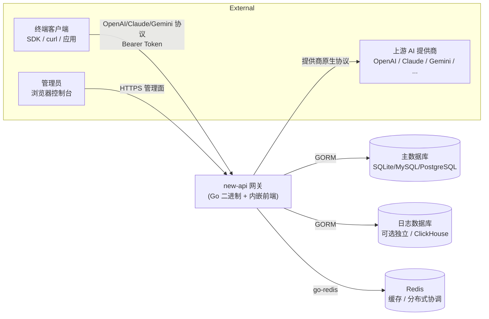
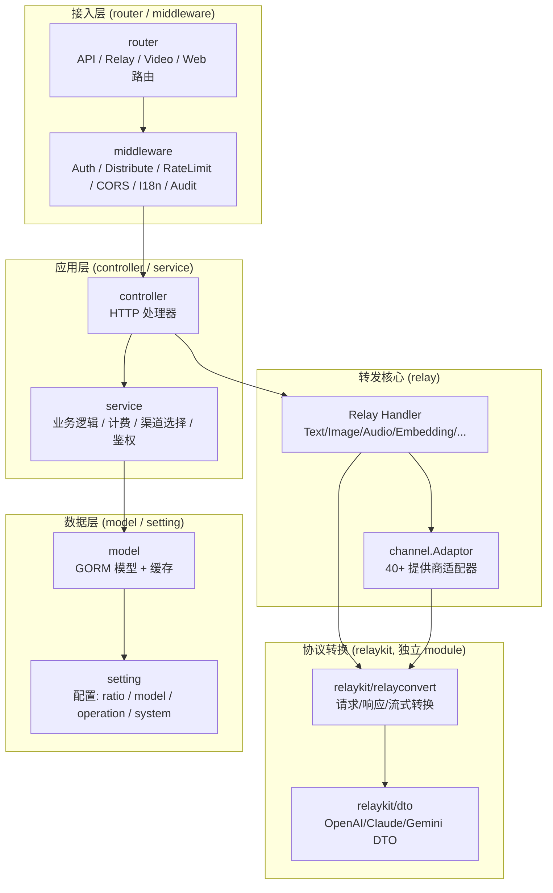
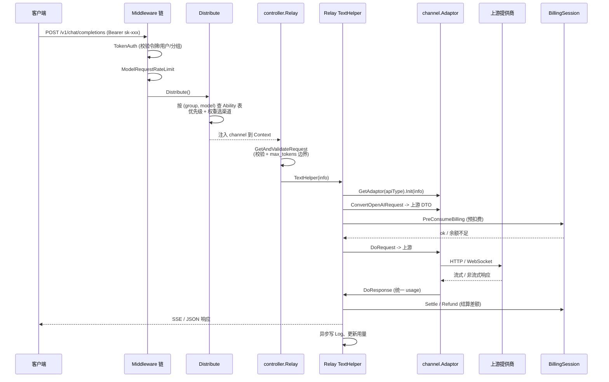
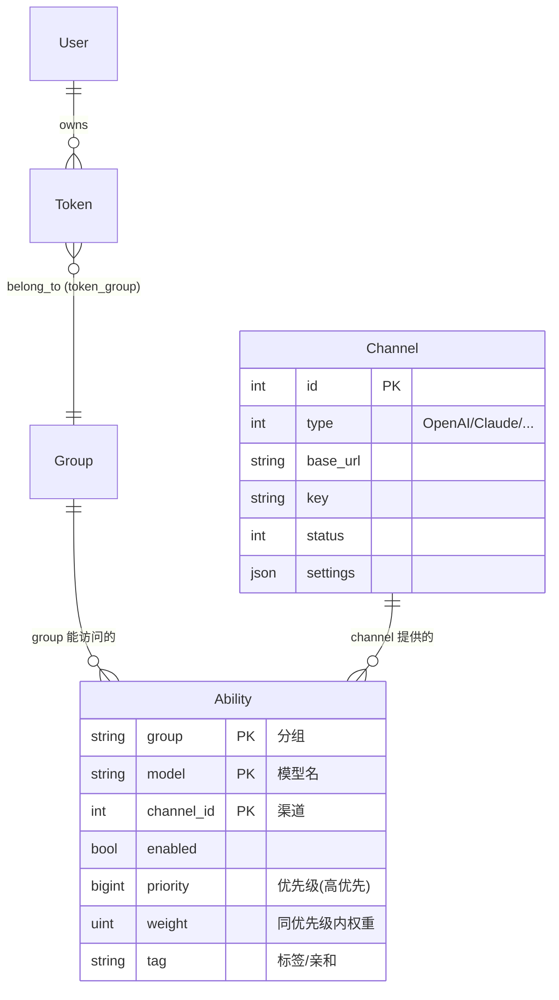
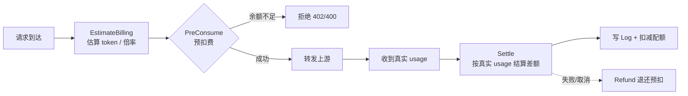
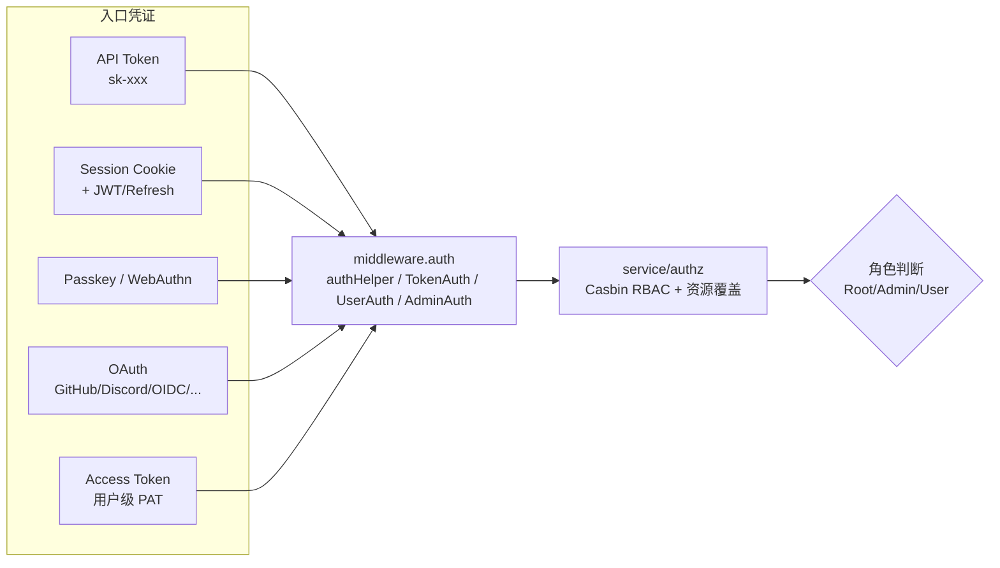
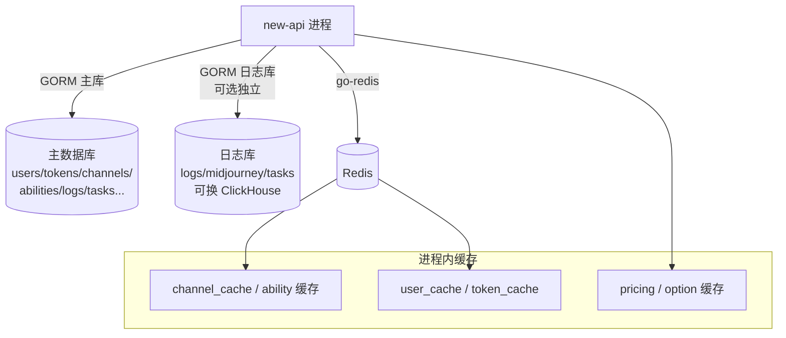
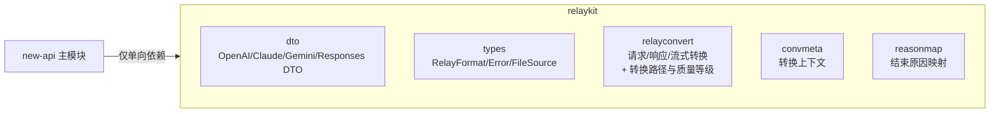
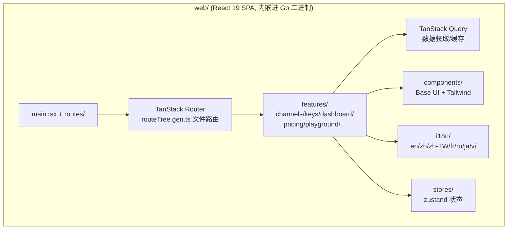
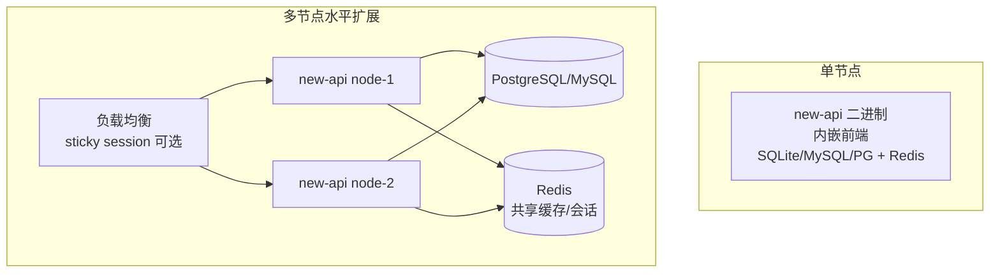

# new-api 系统架构文档

> 本文档以行业标准（C4 模型 + 分层架构）描述 new-api 的整体架构，适用于新成员入门、技术评审与架构演进参考。架构图使用 Mermaid 绘制。

## 1. 系统概述

new-api 是一个 **AI API 网关 / 代理服务（AI Gateway）**，使用 Go 编写。它将 40+ 上游 AI 提供商（OpenAI、Anthropic Claude、Google Gemini、Azure、AWS Bedrock、阿里通义、百度文心、讯飞、智谱等）聚合在统一的 API 之后，并为终端用户提供身份管理、令牌（API Key）管理、配额计费、限流、订阅与多分组渠道调度，配套 React 管理控制台。

核心价值：
- **协议统一**：对外暴露 OpenAI / Claude / Gemini / Responses 多种协议端点，内部自动在协议间转换。
- **多租户与计费**：用户、令牌、分组、配额、订阅一体化，支持预扣费 / 结算 / 退款安全模型。
- **渠道编排**：基于「能力表（Ability）」的优先级 + 权重调度，支持自动跨分组重试。
- **可插拔适配器**：每个上游提供商一个 Adaptor，遵循统一接口。

技术栈速览：

| 层 | 技术 |
|---|---|
| 后端 | Go 1.22+、Gin、GORM v2 |
| 前端 | React 19、TypeScript、Rsbuild、TanStack Router/Query、Base UI、Tailwind |
| 数据库 | SQLite / MySQL ≥ 5.7.8 / PostgreSQL ≥ 9.6（日志库可独立，支持 ClickHouse） |
| 缓存 | Redis（go-redis）+ 进程内缓存 |
| 认证 | JWT、Session Cookie、WebAuthn/Passkey、OAuth（GitHub/Discord/OIDC 等）、Access Token (PAT) |
| 协议转换 | RelayKit（独立 Go module） |

## 2. 容器图（C4 Level 1 — System Context）

部署形态：单个 Go 二进制内嵌前端静态资源（`embed.FS`），通过 `docker-compose` 或裸机 systemd 运行；多实例时以 Redis 共享缓存与会话，以 `SESSION_SECRET` 签发一致的会话 Cookie。

## 3. 分层架构（C4 Level 2 — Container / 分层）

后端采用经典的 **Router → Middleware → Controller → Service → Model** 分层，并横向切出 `relay/`（AI 转发核心）与 `relaykit/`（独立协议转换模块）。

### 目录职责映射

| 目录 | 职责 |
|---|---|
| `router/` | HTTP 路由注册（API、Relay、Video、Dashboard、Web） |
| `middleware/` | 鉴权、限流、分发（Distribute 选渠道）、CORS、i18n、审计、性能检查 |
| `controller/` | 请求处理器，编排 service 与 relay |
| `service/` | 业务逻辑：计费（`billing.go`）、渠道选择（`channel_select.go`）、鉴权（`authz/`）、HTTP 客户端、日志生成 |
| `model/` | GORM 数据模型与数据库访问（User、Token、Channel、Ability、Log、Task、Subscription 等） |
| `relay/` | AI 转发核心：各类 Handler、适配器工厂（`relay_adaptor.go`） |
| `relay/channel/` | 每个上游提供商一个子包，实现 `Adaptor` 接口 |
| `relaykit/` | **独立 Go module**，仅做协议层 DTO 与转换，不依赖主模块 |
| `setting/` | 分领域配置（ratio_setting、model_setting、operation_setting、system_setting、performance_setting、billing_setting） |
| `common/` | 共享工具：JSON 封装、Redis、加密、限流、配额算术（`quota_math.go`） |
| `dto/` | 任务类 DTO（Midjourney、Suno、Video、Task） |
| `constant/` | 渠道类型、API 类型、上下文键常量 |
| `types/` | 通用类型（PriceData、并发 map、set） |
| `oauth/` | OAuth 提供商实现（GitHub/Discord/OIDC/LinuxDO/微信/Telegram） |
| `pkg/` | 内部包：`billingexpr`（表达式计费）、`cachex`、`ionet`、`perf_metrics` |
| `i18n/` | 后端国际化（go-i18n，en/zh） |
| `web/` | 前端（React 19 + Rsbuild） |

## 4. 核心运行时：AI 请求转发流程

这是系统最关键的链路。一次 `/v1/chat/completions` 请求的完整生命周期如下：

关键设计点：

- **RelayFormat**：入口 `controller.Relay(c, relayFormat)` 根据 URL 决定协议形态（OpenAI / Claude / Gemini / Responses / Realtime / Image / Audio / Embedding / Rerank / AlphaSearch）。
- **RelayInfo**：贯穿整个转发流程的上下文对象（`relay/common/relay_info.go`），承载令牌、用户、分组、渠道元数据、计费会话、重试状态等。
- **Adaptor 接口**：每个提供商实现统一的 `Init / GetRequestURL / SetupRequestHeader / ConvertXxxRequest / DoRequest / DoResponse`，屏蔽上游差异。
- **协议转换（RelayKit）**：当客户端协议 ≠ 上游协议时，由 RelayKit 在 OpenAI Chat / Responses / Claude / Gemini 四种文本协议间转换，并返回转换路径与质量等级用于审计。
- **失败重试**：由 `service.RetryParam` 驱动，可在同分组内重试，或在 `auto` 分组下跨分组重试（每组耗尽其优先级后再切换）。

## 5. 渠道调度模型

渠道选择是网关的核心能力，建立在 **Ability（能力）表** 之上：

调度算法（`service/channel_select.go` + `model/ability.go`）：

1. 以 `(token_group, model)` 过滤启用的 Ability。
2. 取**最高优先级**层；在该层内按**权重**随机选择一个渠道。
3. 失败时重试：同分组耗尽后，若开启跨分组（auto group），按分组顺序切换到下一组，重复 2-3。
4. 渠道亲和（channel affinity）可选：通过 tag / 缓存将特定请求粘到特定渠道。

## 6. 计费与配额模型

计费是 new-api 的安全核心，采用 **预扣费（Pre-Consume）→ 结算（Settle）→ 退款（Refund）** 三段式生命周期，由 `BillingSession`（`service/billing_session.go`）封装在 `RelayInfo.Billing` 上。

安全不变量（由 `common/quota_math.go` 集中守护）：

- **永不产生负费用（credit）**：所有用户可控的计费倍数（image `n`、video `seconds`、resolution/quality ratio、batch count、`max_tokens`）必须在请求校验阶段被界定范围（`dto.MaxImageN`、`relaycommon.MaxTaskDurationSeconds`、`maxTokensLimit`）。
- **饱和取整**：禁止裸 `int(float64 * ratio)` 转换，统一用 `common.QuotaFromFloat` / `QuotaRound` / `QuotaFromDecimal`，溢出被钳制到 int32 上限（因 quota 列为 32 位）。
- **异常可审计**：`*Checked` 变体返回 `QuotaClamp`，经 `attachQuotaSaturation` 记录到日志 `admin_info.quota_saturation` 并发 `LogWarn`，非管理员视图自动剥离 `admin_info`。
- **表达式计费**：分层 / 动态定价由 `pkg/billingexpr` 实现（详见 `pkg/billingexpr/expr.md`），`billingexpr.QuotaRound` 委托给 `common.QuotaRound`。

计费来源（`BillingSource`）支持 **钱包配额（wallet）** 与 **订阅（subscription）** 两种，订阅走独立的 `user_subscriptions` 表与额度计算。

## 7. 鉴权与授权

- **Dashboard 面**：`UserAuth` / `AdminAuth` 走 Session（或 PAT），支持 2FA、Passkey、登录态刷新与 OriginGuard。
- **Relay 面**：`TokenAuth` 校验 `Authorization: Bearer sk-xxx`，解析令牌所属用户、分组、模型白名单、特定渠道等上下文，注入 gin Context。
- **RBAC**：`service/authz/` 在 Casbin 规则之上实现角色、权限、资源覆盖与渠道级授权（`resources_channel.go`），支持细粒度渠道访问控制。

## 8. 数据存储与缓存

- **多数据库兼容**：所有 SQL 必须同时在 SQLite / MySQL / PostgreSQL 上运行。GORM 方法优先；行锁统一用 `lockForUpdate(tx)`（SQLite 自动跳过）；保留字列用 `commonGroupCol` / `commonKeyCol`；布尔值用 `commonTrueVal` / `commonFalseVal`。
- **日志库分离**：`LOG_SQL_DSN` 可指向独立库或 ClickHouse，支持 TTL 自动清理。
- **缓存同步**：`SYNC_FREQUENCY`（默认 60s）控制 Redis 与数据库的一致周期；启用 Redis 时多实例共享缓存与令牌黑名单。

## 9. RelayKit —— 独立协议转换模块

`relaykit/` 是一个**独立 Go module**（有自己的 `go.mod`），从主模块剥离，只负责协议层数据建模与语义转换，不含 HTTP / 数据库 / 计费 / 调度逻辑。可被其他 Go 网关嵌入。

约束（见 AGENTS.md）：`relaykit/` **禁止**反向依赖主模块；任何改动须以 `cd relaykit && GOWORK=off go build ./...` 验证。

转换支持矩阵（任意两种文本协议互转，含流式）：OpenAI Chat、OpenAI Responses、Claude Messages、Gemini `generateContent`，质量分 Good / Fair / Discouraged。

## 10. 前端架构

- 构建工具 Rsbuild；包管理器 Bun（首选）。
- i18n：`i18next` + `react-i18next`，扁平 JSON，英文为 key；CLI `bun run i18n:sync`。
- 前端在构建后被 `//go:embed web/dist` 打包进 Go 二进制，由 `router/web-router.go` 提供 SPA 入口。

## 11. 部署拓扑

- 单节点：一个容器 + SQLite/外部 DB + 可选 Redis。
- 多节点：共享外部 DB + Redis；`SESSION_SECRET` 必须一致以签发互通的会话；`NODE_NAME` 用于审计日志区分节点。
- `IsMasterNode` 控制定时任务（缓存刷新、系统任务）只在主节点执行，避免重复。

## 12. 关键横切关注点

| 关注点 | 实现位置 | 说明 |
|---|---|---|
| 限流 | `middleware/rate-limit.go`、`model-rate-limit.go` | 全局、关键操作、按模型三级限流 |
| 审计 | `middleware/audit.go`、`controller/audit.go` | 关键操作落审计日志，带节点名 |
| 国际化 | `i18n/`（后端）、`web/src/i18n/`（前端） | 后端 go-i18n (en/zh)，前端 i18next (7 语言) |
| 可观测 | `pkg/perf_metrics/`、`logger/`、`common.SysError` | 性能指标采集、结构化日志、计费饱和告警 |
| 任务异步 | `model/system_task.go`、`relay/relay_task.go` | Midjourney/Suno/Video 等异步任务轮询与结算 |
| 配置热更新 | `setting/`、`model/option.go` | 多数配置存 DB（options 表），运行时刷新缓存 |
| 多租户分组 | `model/prefill_group.go`、`setting/user_usable_group.go` | 用户/令牌绑定分组，分组决定可见渠道与定价 |

## 13. 架构决策记录（ADR 摘要）

1. **分层 + 适配器模式**：`channel.Adaptor` 接口隔离上游差异，新增提供商只需实现接口并在 `relay_adaptor.go` 注册。
2. **RelayKit 独立模块**：将协议转换从业务中剥离，保证可复用与可独立构建，强制单向依赖。
3. **Ability 表驱动的调度**：把「分组—模型—渠道」关系显式物化为表，调度退化为优先级 + 权重查询，便于缓存与跨分组扩展。
4. **集中式配额算术**：所有计费取整/钳制收口到 `common/quota_math.go`，防止各路径各自实现导致溢出/负费。
5. **三段式计费会话**：预扣—结算—退款封装进 `BillingSession`，绑定到 `RelayInfo`，使重试与跨分组切换下计费语义一致。
6. **多数据库兼容优先**：禁用方言专属语法，行锁/列名/布尔值统一抽象，换取部署灵活性。

---

> 维护提示：本文档反映当前主干架构。若 `relay/`、`relaykit/`、`model/ability.go`、`service/billing*.go` 或计费不变量发生结构性变化，请同步更新本文档及对应 Mermaid 图。
