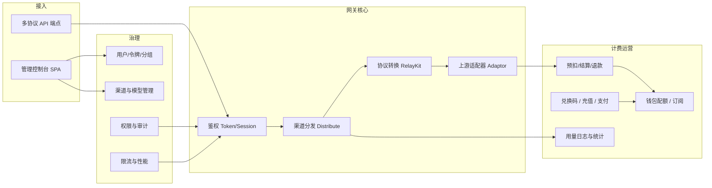
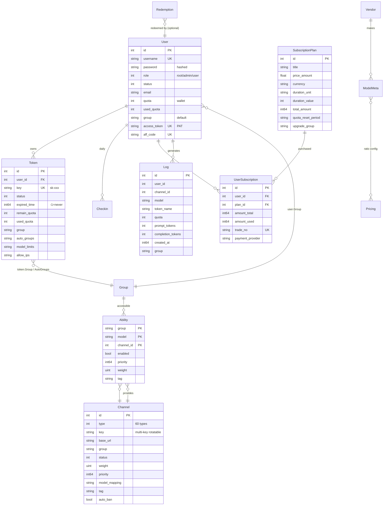

# new-api 产品需求文档（PRD）

> 版本：v1.0 ｜ 状态：基于现有代码逆向提炼 ｜ 维护者：架构组
> 说明：本文档以行业标准 PRD 结构（背景与目标 → 用户与角色 → 范围 → 功能需求 → 非功能需求 → 约束与依赖）描述 new-api 当前已实现的产品形态，作为产品对齐、需求评审与版本规划的基线。文末附「未实现 / 规划中」清单。

---

## 1. 背景与目标

### 1.1 背景
AI 应用开发者需要接入多家大模型与多模态能力提供商（OpenAI、Anthropic Claude、Google Gemini、AWS Bedrock、Azure，以及国内通义/文心/讯飞/智谱/DeepSeek 等），但各提供商在协议、鉴权、计价、能力范围上差异巨大。直接对接面临：协议碎片化、密钥泄露风险、缺乏统一计费与配额、无故障转移、无用量审计等问题。

### 1.2 产品定位
**new-api 是一个自托管（self-hosted）的 AI API 网关（AI Gateway）**，在客户端与上游 AI 提供商之间充当统一接入、统一计费、统一治理的反向代理。

### 1.3 目标
| 编号 | 目标 | 衡量指标 |
|---|---|---|
| G1 | **统一接入**：一套凭证、多协议端点，兼容主流 SDK 开箱即用 | 支持的协议端点数、SDK 兼容性测试通过率 |
| G2 | **统一计费**：对终端用户做配额/订阅计量，对上游做成本归集 | 计费误差率（与上游真实成本偏差）、对账一致性 |
| G3 | **高可用转发**：渠道级故障转移与负载均衡 | 单渠道故障时请求成功率、P95 转发延迟 |
| G4 | **多租户治理**：用户/令牌/分组隔离，细粒度权限 | 权限越权测试零缺陷、租户数据隔离验证 |
| G5 | **可观测与可运营**：用量日志、性能指标、排行榜、审计 | 日志查询 P95、审计事件覆盖率 |

### 1.4 非目标（Non-Goals）
- 不提供模型训练 / 微调能力。
- 不自研模型，仅做转发与协议转换。
- 不做通用 API 网关（如非 AI 的 REST/RPC 代理不在范围内）。
- 不承担上游内容合规审核责任（透传上游策略，运营方可叠加敏感词过滤）。

---

## 2. 用户角色与权限

系统采用 RBAC + 资源级权限模型（基于 Casbin），核心角色三级：

| 角色 | 标识 | 典型场景 | 关键权限 |
|---|---|---|---|
| **普通用户（User）** | `RoleCommonUser` | 终端开发者，使用 API 与管理面板 | 管理自己的令牌、查看自己的用量与日志、充值/订阅、个人信息与安全设置 |
| **管理员（Admin）** | `RoleAdminUser` | 运营/运维人员 | 用户管理、渠道读写与运维（含敏感写受控）、兑换码、分组、模型元数据、查看全局日志与统计 |
| **超级管理员（Root）** | `RoleRootUser` | 系统负责人 | 系统设置（option）、自定义 OAuth 提供商、性能与系统信息、费率同步、订阅计划管理、渠道密钥查看 |

管理员在「渠道」资源上进一步细分为四档权限（`service/authz`）：
- `ChannelRead`：查看渠道
- `ChannelWrite`：编辑渠道配置
- `ChannelOperate`：测试、启停、批量操作、修复能力表
- `ChannelSensitiveWrite`：创建/删除渠道、查看密钥（需二次安全验证）

---

## 3. 范围（Scope）

### 3.1 核心业务流程总览

### 3.2 支持的上游能力矩阵

**文本/多模态协议（同步，含流式）：**

| 客户端协议端点 | RelayFormat | 典型用途 |
|---|---|---|
| `/v1/chat/completions`、`/v1/completions` | OpenAI | 对话补全、Moderation |
| `/v1/messages` | Claude | Anthropic Messages 协议 |
| `/v1/responses`、`/v1/responses/compact` | OpenAI Responses | Responses API（含压缩） |
| `/v1beta/models/*` | Gemini | Gemini `generateContent` |
| `/v1/embeddings` | Embedding | 向量嵌入 |
| `/v1/rerank` | Rerank | 重排序 |
| `/v1/audio/transcriptions`、`translations`、`speech` | OpenAI Audio | 语音转写 / 翻译 / 合成 |
| `/v1/images/generations`、`/images/edits` | OpenAI Image | 图像生成 / 编辑 |
| `/v1/realtime`（WebSocket） | OpenAI Realtime | 实时多模态对话 |
| `/v1/alpha/search` | Alpha Search | Codex 独立 Web 搜索 |
| `/pg/chat/completions` | Playground | 控制台内置试用（Session 鉴权） |

**异步任务（提交 → 轮询 → 结算）：**

| 端点 | 平台 | 用途 |
|---|---|---|
| `/mj/*`、`/:mode/mj/*` | Midjourney / MidjourneyPlus | 文生图、图生图、变换、放大 |
| `/suno/*` | Suno | 音乐/歌词生成 |
| `/v1/video/generations`、`/v1/videos` | Kling / Jimeng / Vidu / Sora / Doubao / Hailuo / Gemini / Vertex / Ali | 视频生成 |
| `/kling/v1/videos/*` | Kling 原生格式 | Kling 官方协议兼容 |
| `/jimeng/` | Jimeng 原生格式 | 即梦官方协议兼容 |

**支持的渠道类型（节选，共 60 类）：** OpenAI、Azure、Anthropic、Gemini、Vertex AI、AWS Bedrock、DeepSeek、xAI、Mistral、Cohere、Perplexity、Moonshot、Ali(通义)、Baidu(文心)/BaiduV2、Zhipu/ZhipuV4、Tencent、Xunfei、360、MiniMax、SiliconFlow、Ollama、OpenRouter、Cloudflare、Dify、Coze、Replicate、Jina、MokaAI、VolcEngine、Xinference、Codex、Submodel、Sub2API、NewAPI（级联）、AdvancedCustom（自定义）等。

---

## 4. 功能需求

> 编号规则：`F-{域}-{序号}`。优先级 P0=必须有 / P1=应该有 / P2=可以有。

### 4.1 用户与身份（F-IDENT）

| 编号 | 需求 | 优先级 |
|---|---|---|
| F-IDENT-01 | 用户注册/登录（用户名密码），支持注册开关、邮箱验证、Turnstile 人机校验 | P0 |
| F-IDENT-02 | 会话管理：JWT Access + Refresh Token，Session Cookie，登录会话列表与远程登出，OriginGuard 防 CSRF | P0 |
| F-IDENT-03 | OAuth 第三方登录：GitHub、Discord、LinuxDO、通用 OIDC、微信、Telegram；管理员可配置自定义 OAuth 提供商（含 OIDC Discovery） | P1 |
| F-IDENT-04 | WebAuthn / Passkey 无密码登录与绑定（注册/验证/删除，管理员可重置） | P1 |
| F-IDENT-05 | 双因素认证（2FA TOTP）、备用恢复码、登录二次验证、管理员强制禁用 | P1 |
| F-IDENT-06 | 用户级 Access Token（PAT），用于管理面 API 调用 | P1 |
| F-IDENT-07 | 邀请返佣（Affiliate）：邀请码、邀请人数/额度统计、额度转移 | P2 |

### 4.2 令牌管理（F-TOKEN）

| 编号 | 需求 | 优先级 |
|---|---|---|
| F-TOKEN-01 | 创建/编辑/删除 API Token（`sk-xxx`），支持名称、状态、过期时间、剩余配额 | P0 |
| F-TOKEN-02 | 令牌模型白名单（`model_limits`）：限制令牌仅可调用指定模型 | P0 |
| F-TOKEN-03 | 令牌 IP 白名单（`allow_ips`） | P1 |
| F-TOKEN-04 | 令牌绑定分组（`group`）与**自动跨分组（`auto_groups`）**：失败时按分组顺序自动切换，最多 N 个分组 | P1 |
| F-TOKEN-05 | 令牌指定渠道（绕过分发，直接命中某渠道） | P1 |
| F-TOKEN-06 | 批量操作：批量删除、批量导出密钥（受关键操作限流） | P2 |
| F-TOKEN-07 | 令牌用量查询接口（`/api/usage/token`，Token 只读鉴权，供客户端展示） | P1 |

### 4.3 渠道管理（F-CHAN）

| 编号 | 需求 | 优先级 |
|---|---|---|
| F-CHAN-01 | 渠道 CRUD：类型、密钥（多 Key 轮询）、BaseURL、所属分组、模型映射（`model_mapping`）、权重、优先级、状态码映射 | P0 |
| F-CHAN-02 | 渠道分组（`group`）与标签（`tag`）：按分组隔离可见模型与定价；按标签批量启停/编辑 | P0 |
| F-CHAN-03 | 渠道测试：单渠道测试、全量测试，自动禁用（`auto_ban`）失败渠道 | P0 |
| F-CHAN-04 | 渠道余额查询与定时更新（`update_balance`） | P1 |
| F-CHAN-05 | 渠道能力表修复（`/channel/fix`）：根据渠道模型重建 `abilities` 表 | P1 |
| F-CHAN-06 | 高级配置：参数覆盖（`param_override`）、请求头覆盖（`header_override`）、透传原始请求体（`pass_through`）、渠道级设置（`setting`） | P1 |
| F-CHAN-07 | 渠道亲和（channel affinity）：按 tag / 使用缓存将请求粘到特定渠道，可统计与清理缓存 | P2 |
| F-CHAN-08 | 渠道密钥查看需二次安全验证（Secure Verification），仅 Root 可用 | P0 |
| F-CHAN-09 | 渠道级 RBAC（Read/Write/Operate/SensitiveWrite 四档） | P1 |

### 4.4 模型与定价（F-PRICE）

| 编号 | 需求 | 优先级 |
|---|---|---|
| F-PRICE-01 | 模型元数据（`model_meta`）管理：名称、描述、图标、标签、厂商、端点、启用分组、计费类型（按量/按次） | P0 |
| F-PRICE-02 | 模型倍率配置：模型倍率（`model_ratio`）、补全倍率（`completion_ratio`）、缓存倍率（`cache_ratio`）、分组倍率（`group_ratio`）、暴露倍率（`expose_ratio`） | P0 |
| F-PRICE-03 | 分组定价：不同用户分组对同一模型可设不同倍率 | P0 |
| F-PRICE-04 | 上游费率同步（`/api/ratio_sync`）：从上游渠道拉取官方定价预览并应用 | P1 |
| F-PRICE-05 | 模型从上游同步（`/models/sync_upstream`）：预览并导入上游支持的模型列表 | P1 |
| F-PRICE-06 | 缺失模型检测（`/models/missing`）：发现已配置但无可用渠道的模型 | P1 |
| F-PRICE-07 | 厂商（Vendor）元数据管理 | P2 |
| F-PRICE-08 | 公开定价页（`/api/pricing`、`/pricing`）：向终端展示模型价格表（可按模块鉴权） | P1 |

### 4.5 计费与配额（F-BILL）

| 编号 | 需求 | 优先级 |
|---|---|---|
| F-BILL-01 | **三段式计费生命周期**：预扣费（Pre-Consume）→ 结算（Settle，按真实 usage 差额补退）→ 退款（Refund，失败/取消时退还预扣） | P0 |
| F-BILL-02 | 钱包配额：用户/令牌配额（quota），支持剩余配额、已用配额、请求计数 | P0 |
| F-BILL-03 | 订阅计费（`subscription`）：订阅计划、额度上限（`amount_total`/`amount_used`）、周期重置（`quota_reset_period`）、升降级分组（`upgrade_group`/`downgrade_group`） | P1 |
| F-BILL-04 | 计费来源切换（`BillingSource`）：钱包优先或订阅优先，用户可设偏好 | P1 |
| F-BILL-05 | 表达式计费（`pkg/billingexpr`）：支持分层/动态定价表达式，版本化管理 | P2 |
| F-BILL-06 | 异步任务计费：提交时强制全额预扣（`ForcePreConsume`），轮询完成时按实际参数（时长/分辨率）结算差额 | P0 |
| F-BILL-07 | 计费安全不变量：永不产生负费用；所有倍数（image n、video seconds、max_tokens）请求级界定范围；饱和取整防溢出；异常记入审计 | P0 |
| F-BILL-08 | 兑换码（`redemption`）：批量生成、兑换、过期、失效清理 | P1 |
| F-BILL-09 | 签到（`checkin`）：每日签到赠送配额，防重复 | P2 |

### 4.6 支付与充值（F-PAY）

| 编号 | 需求 | 优先级 |
|---|---|---|
| F-PAY-01 | 多支付网关：易支付（Epay）、Stripe、Creem、Waffo、Waffo-Pancake | P1 |
| F-PAY-02 | 充值下单 → 支付回调 → 到账，支持金额估算、订单管理（`topup`） | P0 |
| F-PAY-03 | 订阅购买：余额支付、各网关支付、Webhook 回调、支付合规确认 | P1 |
| F-PAY-04 | 管理员补单（`admin/topup/complete`）、用户充值记录查询 | P1 |
| F-PAY-05 | Waffo-Pancake 商品目录与订阅产品配对管理 | P2 |

### 4.7 分发与转发（F-RELAY）

| 编号 | 需求 | 优先级 |
|---|---|---|
| F-RELAY-01 | 渠道分发：按 `(group, model)` 查能力表，最高优先级层内按权重随机选择 | P0 |
| F-RELAY-02 | 故障重试：同分组内重试；`auto` 分组跨分组重试（每组耗尽优先级后切换） | P0 |
| F-RELAY-03 | 协议转换（RelayKit）：OpenAI Chat / Responses / Claude / Gemini 间任意互转，含流式，返回转换路径与质量等级 | P0 |
| F-RELAY-04 | 流式响应（SSE）、流式 usage（`stream_options.include_usage`）、流式超时控制 | P0 |
| F-RELAY-05 | WebSocket 实时转发（Realtime），客户端与上游双向 WebSocket | P1 |
| F-RELAY-06 | 透传模式（`pass_through`）：直接转发原始请求体，跳过协议转换 | P1 |
| F-RELAY-07 | 模型重定向：`chat/completions` 自动走 Responses（可全局/渠道配置） | P2 |
| F-RELAY-08 | 客户端断连取消上游请求（如 AWS Bedrock cancel-on-disconnect） | P1 |

### 4.8 日志与可观测（F-OBS）

| 编号 | 需求 | 优先级 |
|---|---|---|
| F-OBS-01 | 请求日志：每次调用记录模型、令牌、用户、渠道、分组、token 用量、配额消耗、耗时、错误，管理员看全局 / 用户看自己 | P0 |
| F-OBS-02 | 日志搜索（管理员全局搜索、用户自搜索，受搜索限流） | P0 |
| F-OBS-03 | 日志统计（`/log/stat`、`/log/self/stat`）：按时间/模型/分组聚合 | P1 |
| F-OBS-04 | 配额流水（`/data`、`/data/flow`）：按日/用户的配额变动与流向 | P1 |
| F-OBS-05 | 性能指标（`/api/perf-metrics`）：渠道延迟、成功率、TPS，公开摘要 + 详细（受模块鉴权） | P1 |
| F-OBS-06 | 排行榜（`/api/rankings`）：模型/用户消耗排行（可按模块鉴权开放） | P2 |
| F-OBS-07 | 日志清理系统任务（`/system-task/log-cleanup`）：定时清理过期日志 | P1 |
| F-OBS-08 | 日志库独立部署，支持 ClickHouse + TTL 自动清理 | P1 |
| F-OBS-09 | 计费饱和审计：溢出/钳制事件记入 `admin_info.quota_saturation` 并告警，非管理员视图剥离 | P0 |

### 4.9 系统设置与运维（F-SYS）

| 编号 | 需求 | 优先级 |
|---|---|---|
| F-SYS-01 | 系统选项（`option`）热配置：站点信息、注册/登录策略、展示模块开关、监控、令牌策略、配额策略、支付配置、敏感词 | P0 |
| F-SYS-02 | 多实例系统信息（`/system-info/instances`）：节点注册、心跳、陈旧节点清理 | P1 |
| F-SYS-03 | 性能运维（`/performance`）：运行时统计、磁盘缓存清理、强制 GC、日志文件管理 | P1 |
| F-SYS-04 | 预填充分组（`prefill_group`）：预设分组模板 | P2 |
| F-SYS-05 | Dashboard 兼容端点（`/dashboard/billing/*`）：兼容 OpenAI 计费查询协议 | P1 |
| F-SYS-06 | 模型部署管理（`/deployments`）：基于 io.net 的 GPU 部署（硬件类型、地区、估价、容器日志） | P2 |
| F-SYS-07 | Codex 集成：OAuth 凭证刷新、模型同步、用量同步 | P2 |

### 4.10 控制台前端（F-UI）

| 编号 | 需求 | 优先级 |
|---|---|---|
| F-UI-01 | 功能模块：仪表盘、渠道、令牌（keys）、用户、模型、定价、用量日志、兑换码、订阅、钱包、排行榜、性能指标、系统设置、Playground、个人信息 | P0 |
| F-UI-02 | Playground：控制台内试用对话（Session 鉴权） | P1 |
| F-UI-03 | 国际化：en/zh/zh-TW/fr/ru/ja/vi，i18next，英文为 key | P1 |
| F-UI-04 | 初始化引导（Setup）：首启创建 Root 账号 | P0 |
| F-UI-05 | 访客可见页：关于、定价、用户协议、隐私政策、排行榜 | P1 |

---

## 5. 非功能需求（NFR）

### 5.1 可靠性
- **NFR-REL-01** 计费准确：单次请求计费与上游真实 token 成本偏差受倍率配置控制；预扣—结算—退款在重试与跨分组场景下保持一致，不漏扣、不重复扣、不产生负费用。
- **NFR-REL-02** 渠道故障自动转移：单渠道失败不影响整体请求成功率（在有能力冗余时）。
- **NFR-REL-03** 客户端断连时取消上游请求，避免空跑成本。

### 5.2 性能
- **NFR-PERF-01** 同步转发 P95 延迟开销（剔除上游 RTT）应可忽略，进程内缓存命中时渠道选择为 O(1) 级。
- **NFR-PERF-02** 流式首字节时间受 `STREAMING_TIMEOUT` 控制，默认 120s。
- **NFR-PERF-03** 批量更新（`BATCH_UPDATE_ENABLED`）合并配额写盘，降低 DB 压力。

### 5.3 安全
- **NFR-SEC-01** 密钥与敏感字段不明文日志输出；渠道密钥查看需二次安全验证。
- **NFR-SEC-02** 多级限流：全局 API、关键操作（Critical）、搜索（Search）、按模型（Model Rate Limit）。
- **NFR-SEC-03** 请求体大小限制（匿名/登录分级），防止超大请求耗尽资源。
- **NFR-SEC-04** 可信代理（`TRUSTED_PROXIES`）配置，正确识别真实客户端 IP；会话 Cookie 安全（Secure/OriginGuard）。
- **NFR-SEC-05** 计费倍数请求级界定（`MaxImageN`、`MaxTaskDurationSeconds`、`maxTokensLimit`），拒绝越界值返回 400。
- **NFR-SEC-06** 审计日志覆盖关键操作，含节点名（`NODE_NAME`）。

### 5.4 可扩展性
- **NFR-SCALE-01** 水平扩展：多实例共享外部 DB + Redis，`SESSION_SECRET` 一致即可；主节点（`IsMasterNode`）独占定时任务。
- **NFR-SCALE-02** 数据库可替换：SQLite / MySQL ≥ 5.7.8 / PostgreSQL ≥ 9.6；日志库可独立或换 ClickHouse。

### 5.5 可维护性
- **NFR-MAINT-01** 后端分层（Router→Middleware→Controller→Service→Model），新增上游仅需实现 `channel.Adaptor` 接口并注册。
- **NFR-MAINT-02** 协议转换独立为 RelayKit 模块，可独立构建与复用。
- **NFR-MAINT-03** 前后端独立构建，前端产物内嵌进 Go 二进制（`embed.FS`）。

### 5.6 兼容性
- **NFR-COMPAT-01** 客户端协议兼容：原生支持 OpenAI / Claude / Gemini / Responses SDK 端点，无需改 SDK。
- **NFR-COMPAT-02** 上游协议兼容：60 类渠道类型，含国内主流与开源推理（Ollama/Xinference）。

### 5.7 国际化
- **NFR-I18N-01** 后端错误消息 i18n（en/zh）；前端 7 语言。

---

## 6. 关键业务规则

### 6.1 计费规则（详）
1. **预扣**：请求校验通过后，按估算 token（或异步任务的最大参数）计算预扣额；余额不足直接拒绝（402/400）。
2. **结算**：收到上游真实 `usage` 后，按 `model_ratio × (prompt + completion × completion_ratio) × group_ratio` 重算，与预扣差额多退少补。
3. **退款**：请求失败或被取消，全额退还预扣（异步任务在终态失败时退）。
4. **饱和保护**：所有 float→int 取整经 `common.QuotaFromFloat/QuotaRound`，溢出钳制到 int32 上限；`*Checked` 变体捕获钳制事件写入审计。
5. **倍数界定**：image `n` ≤ `MaxImageN`；video `seconds/duration` ≤ `MaxTaskDurationSeconds`；`max_tokens` 系列经各 RelayFormat 校验器界定；passthrough/metadata/form 字段携带的同类倍数同样受限。
6. **计费来源**：`wallet`（钱包配额）或 `subscription`（订阅额度），按用户偏好与可用性选择。

### 6.2 分发规则（详）
1. 过滤：`(token_group, model)` 且 `enabled=true` 的能力记录。
2. 分层：取 `priority` 最高层。
3. 抽样：层内按 `weight` 加权随机选一个渠道。
4. 重试：失败后递增 `Retry`，同层内换渠道；同分组耗尽后，`auto_groups` 模式下切换到下一分组回到步骤 1。
5. 亲和：启用时，`tag`/使用缓存优先命中特定渠道。

### 6.3 权限规则（详）
- 渠道资源四档：Read/Write/Operate/SensitiveWrite，Admin 默认有前三档，SensitiveWrite（创建/删除/看密钥）需显式授予或 Root。
- 普通用户仅能操作自己的资源（令牌、日志、个人信息、充值）。
- Root 独占：系统设置、OAuth 提供商、性能与系统信息、费率同步。

---

## 7. 数据模型（核心实体）

---

## 8. 约束与依赖

### 8.1 技术依赖
- Go 1.22+（实际 go.mod 声明 1.25.1）、Gin、GORM v2、go-redis。
- React 19、Rsbuild、TanStack Router/Query、Base UI、Tailwind、Bun。
- 可选：Redis、ClickHouse、io.net（部署功能）、各支付网关账号。

### 8.2 工程约束（摘自 AGENTS.md）
- JSON 操作必须经 `common.*` 封装，禁止直接 `encoding/json` 调用。
- 数据库代码须三库兼容；行锁用 `lockForUpdate`；保留字列用 `commonGroupCol/commonKeyCol`。
- 配额取整集中到 `common/quota_math.go`，禁止裸 cast。
- RelayKit 模块禁止反向依赖主模块，改动须 `cd relaykit && GOWORK=off go build ./...` 验证。
- 受保护标识（new-api / QuantumNous）不得修改、删除或替换。

### 8.3 合规依赖
- 支付合规确认（`/api/option/payment_compliance`）须在启用支付前完成。
- 用户协议与隐私政策页（`/api/user-agreement`、`/api/privacy-policy`）须运营方填写。

---

## 9. 验收标准（核心场景，Given-When-Then）

**AC-1 钱包计费准确性**
- Given 用户余额 1000 配额，模型倍率 1.0、补全倍率 3.0、分组倍率 1.0
- When 发起一次 chat 请求，上游返回 prompt=10、completion=20
- Then 预扣 ≥ 估算额；结算后实际扣除 = (10 + 20×3)×1×倍率单位；日志记录该 quota；用户余额减少该值；无负费用

**AC-2 渠道故障转移**
- Given 模型 M 在分组 G 下有渠道 A(优先级高,启用) 与渠道 B(优先级低,启用)
- When A 返回 5xx
- Then 系统自动重试 B；最终客户端收到 B 的成功响应；日志记录重试

**AC-3 跨分组自动重试**
- Given 令牌开启 auto_groups=[G1, G2]，G1 无可用渠道
- When 发起请求
- Then 系统切到 G2 选渠道；`UsingGroup` 变为 G2；计费按 G2 倍率

**AC-4 协议转换**
- Given 客户端用 OpenAI SDK 调 `/v1/chat/completions`，命中的渠道是 Claude 类型
- When 请求转发
- Then RelayKit 将 OpenAI 请求转为 Claude Messages；上游响应转回 OpenAI 格式；流式分片正确合并 usage

**AC-5 计费饱和保护**
- Given 上游返回异常巨大的 token 数（接近 int32 上限）
- When 结算
- Then 配额被钳制到上限而非溢出回绕；`quota_saturation` 写入日志 `admin_info`；后端发出 LogWarn；普通用户日志不显示该字段

**AC-6 权限隔离**
- Given 普通用户 U1 的令牌
- When U1 请求查看全局日志或他人渠道
- Then 返回 403；审计记录该越权尝试

**AC-7 多数据库兼容**
- Given 同一份 schema 与查询
- When 分别在 SQLite / MySQL / PostgreSQL 运行
- Then 行锁、保留字列、布尔值、迁移均正常；`FOR UPDATE` 在 SQLite 被跳过

---

## 10. 未实现 / 规划中（Out-of-Current-Scope）

> 以下为代码中标注 `RelayNotImplemented` 或属扩展能力，列为后续规划：

- OpenAI Files API（`/v1/files/*`）：当前返回未实现占位。
- OpenAI Fine-tunes API（`/v1/fine-tunes/*`）：当前返回未实现占位。
- `images/variations`：未实现。
- 通用模型删除（`DELETE /v1/models/:model`）：未实现。
- 更多支付网关接入（随市场需求）。
- 更丰富的内容合规层（当前为可选敏感词，非完整审核管线）。

---

## 附录 A：术语表

| 术语 | 含义 |
|---|---|
| 渠道（Channel） | 一个上游提供商的接入配置（密钥、地址、类型） |
| 分组（Group） | 渠道与用户的逻辑隔离维度，决定可见模型与定价倍率 |
| 令牌（Token） | 颁发给终端客户端的 API Key（`sk-xxx`） |
| 能力表（Ability） | `(group, model, channel)` 三元组，描述哪个分组能用哪个渠道调哪个模型 |
| 倍率（Ratio） | 计费乘数：模型倍率、补全倍率、缓存倍率、分组倍率 |
| 预扣费（Pre-Consume） | 请求转发前按估算先扣的配额 |
| RelayKit | 独立的协议转换 Go 模块 |
| RelayFormat | 请求的协议形态枚举（OpenAI/Claude/Gemini/...） |
| auto_groups | 令牌的自动跨分组重试分组列表 |
| PAT | Personal Access Token，用户级管理面凭证 |

## 附录 B：文档维护

- 本 PRD 基于主干代码逆向提炼，反映**当前已实现**的产品形态。
- 当 `router/`、`controller/`、`model/`、`setting/` 出现新功能域或角色权限变化时，应同步更新第 4 章与第 2 章。
- 当计费规则、分发规则、安全不变量变化时，应同步更新第 6 章与 NFR-SEC/REL。
- 新增「未实现」项落地后，应从第 10 章迁移至对应功能域。
